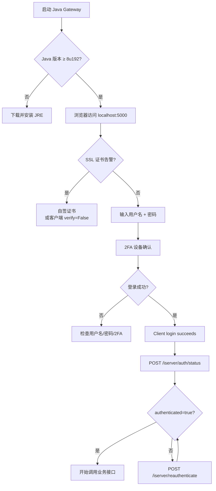

# 认证（Authentication）

> **英文原文**：[Client Portal API Documentation / Authentication](https://interactivebrokers.github.io/cpwebapi/authentication)（Individual 标签页）+ [Quickstart Step 1-5](https://interactivebrokers.github.io/cpwebapi/quickstart) + [Use Cases → Invalid SSL / 2FA / Automated login](https://interactivebrokers.github.io/cpwebapi/use-cases)
> **翻译版本**：v1
> **译者**：@shalico2019

## 概述

Client Portal API 的"认证"覆盖三件事：

1. **建立受信任的本地连接** —— 自签 SSL 证书、Gateway 启动、Java 运行环境。
2. **完成 brokerage session 登录** —— 用户名 / 密码 / **2FA（Two-Factor Authentication，双因素认证）**。
3. **会话级别的合法性问题** —— 谁可以登录、能不能自动化、机构客户能否用 OAuth。

这一节聚焦"登录之前需要做什么"以及"登录的限制条件"。具体的保活、踢下线等动作放在 [Session](./session.md)。

## 1. 浏览器 SSL 警告

当你在浏览器访问 Gateway 登录页（默认 `https://localhost:5000`）时，会看到浏览器提示"证书无效"。这是**正常的**——Gateway 自身不携带受信任的 SSL 证书，需要由用户自签或接入第三方证书签发。

官方推荐的解决办法（详见 [Use Cases → Invalid SSL certificate](https://interactivebrokers.github.io/cpwebapi/use-cases#invalid-ssl-certificate)）：

1. 用 [Java keytool 教程](https://www.sslshopper.com/article-how-to-create-a-self-signed-certificate-using-java-keytool.html) 生成 `*.jks` 自签证书。
2. 把 `*.jks` 放到 Gateway 的 `root/` 目录。
3. 在 `root/conf.yaml` 中更新 `sslCert` 和 `sslPwd` 字段，写入生成时使用的路径与密码。
4. 重启 Gateway。

> 对纯脚本调用方来说，更常见的做法是直接在 `requests` / 任何 HTTP 客户端中**关闭证书校验**（`verify=False`），因为 Gateway 是本机服务，TLS 仅用来加密，本地信任链不构成安全风险。

## 2. Java 运行环境

Gateway 用 Java 写的，最低要求 **Java 8 update 192**。检查本地 Java：

```bash
java --version
# 期望输出形如：
# java 17.0.1 2021-10-19 LTS
```

没有装的话去 <https://www.java.com/en/download/> 下载。Java 缺失会让 `bin/run.sh` 启动后立刻退出且无明确报错——这是新手最常踩的坑之一。

## 3. Session 认证（手动登录 + 2FA）

文档原文把 Session 认证的约束写得非常清楚，下面是直接翻译：

> 一个**已认证**的 brokerage session 是通过 Client Portal API 访问订单信息、下单或接收行情数据的**必要条件**。个人（Individual）客户必须使用 Client Portal API Gateway 来建立安全的 brokerage session，目前**没有官方绕过此要求的方法**。IBKR 其他交易应用（TWS、IBKR Mobile）也采用 brokerage session 这一概念。

需要注意的限制：

- **单点登录**：一个用户名在同一时刻只能存在**一个** brokerage session。无论你是打开 TWS、登录 IBKR Mobile、还是用第三方程序连接，都会把当前 Client Portal API session 顶掉，反之亦然。
- **每天重新登录**：出于安全考虑，**最多 24 小时**必须人工重新鉴权一次。如果赶上 IBKR 服务器每日维护，可能不到 24 小时就会被强制下线。
- **5 分钟无活动即超时**：如果 5 分钟内 Gateway 没收到任何请求，session 就会失效。所以一定要定期调用 `/tickle` 或 `/sso/validate`（详见 [Session](./session.md)）。

如何判定当前 session 是否已认证？调用：

```python
import requests
BASE = "https://localhost:5000/v1/api"

status = requests.post(f"{BASE}/iserver/auth/status", verify=False, timeout=5).json()
print(status["authenticated"], status["connected"], status["competing"])
```

成功时返回的 JSON 中 `authenticated: true`、`competing: false`、`connected: true`。详细字段含义请看 [Session → /iserver/auth/status](./session.md)。

## 4. 自动化登录：能做到吗？

官方对"自动化 brokerage session 登录"的答复非常明确，翻译如下：

> **Q：能否自动化 Client Portal API 认证流程？**
> 目前 IBKR 端没有任何机制允许个人客户在 Client Portal API 中**自动化** brokerage session 鉴权。
>
> **Q：能否使用第三方方案来自动化登录？**
> IBKR **不建议**使用第三方方案建立 brokerage session，这会让你的账户暴露于潜在的恶意项目。IBKR 也**无法为第三方封装库提供技术支持**。

翻译成工程上的现实就是：

- 不要尝试用 Selenium / Playwright 自动填表登录——`localhost:5000` 的登录页可能随时改版，且 2FA 设备（IBKR Mobile / 安全密钥 / SMS）无法绕过。
- 市面上常见的 Python 封装（如 `ibc`、`ibw`）也都明确写了："仍然需要用户**手动**完成首次登录"。
- 如果你确实需要无人值守运行，要么用机构账户走 **OAuth**，要么改用 **TWS API**（只需在 TWS 设置里开启 API、不需要每天点 2FA）。

## 5. 2FA 是否可以关闭？

> **Q：能否在不使用 2FA 设备的情况下认证实时 brokerage session？**
> Client Portal API Gateway 的登录流程与 Client Portal 相同。由于 Client Portal 拥有访问敏感信息与银行功能的权限，**双因素认证是登录的强制要求**。

具体来说：

- 对应到 [Use Cases](https://interactivebrokers.github.io/cpwebapi/use-cases) 中的 *"Opting out of 2FA"*：因为 CP API 能查资金、银行转账，所以**不能像部分 TWS 场景那样关闭 2FA**。
- 你的 2FA 设备可以是：**IBKR Mobile**（推送）、**SMS**（不推荐）、**物理安全密钥（Security Key）** 等。

## 6. 机构客户（Institutional）认证

顶部有 "Individual / Institutional" 切换标签，机构客户的认证路径与个人客户不同：

- 不需要本机 Gateway，而是通过 **OAuth 1.0a** 或 **Dedicated Connection** 直接与 IBKR 后端通信。
- 一次性申请 OAuth consumer key/secret，之后用标准 OAuth 流程换 access token。
- 由于本仓库面向个人/中小型开发者，OAuth 的细节不在本节展开；如需对接，建议直接联系 IBKR API 销售。

## 完整登录流程（决策图）



## Python 最小调用脚本

把 SSL 处理、心跳、状态查询串成一个可独立运行的脚本：

```python
import time
import requests

BASE = "https://localhost:5000/v1/api"
requests.packages.urllib3.disable_warnings()


def status():
    return requests.post(f"{BASE}/iserver/auth/status",
                         verify=False, timeout=5).json()


def tickle():
    return requests.post(f"{BASE}/tickle", verify=False, timeout=5).json()


def main():
    # 1) 确认已登录
    s = status()
    if not s.get("authenticated"):
        # 需要人工在浏览器完成登录或 2FA
        print("⚠️ 请先在浏览器访问 https://localhost:5000 完成登录")
        return

    # 2) 进入业务循环 + 每分钟心跳
    while True:
        try:
            tickle()
            print("[tickle OK]")
        except requests.RequestException as e:
            print("session error:", e)
        time.sleep(60)


if __name__ == "__main__":
    main()
```

## 常见错误码

| HTTP Code | 含义 | 建议处理 |
| --- | --- | --- |
| `401 Unauthorized` | session 已失效或被踢 | 重新走 Gateway 浏览器登录 + 2FA |
| `403 Forbidden` | 通常是 OAuth 凭据失效或 IP 白名单不符 | 机构客户检查 OAuth consumer key/secret |
| `404 Not Found` | Gateway 版本太旧或路径拼错 | 升级 Gateway |
| `429 Too Many Requests` | 触发限频，IP 进入"惩罚箱" | 等待 10 分钟 |

## 与 TWS API 的差异

| 维度 | Client Portal API | TWS API |
| --- | --- | --- |
| 鉴权强度 | 强制 2FA，每天必须人工一次 | 可在 TWS 设置里只勾用户名/密码（视账户类型） |
| 是否可自动化登录 | ❌ 不支持（个人账户） | ✅ 配置文件 + `ibc` 等工具可无人值守 |
| 机构方案 | OAuth 1.0a / Dedicated | 同样支持 |
| 强制重登周期 | 24 小时 | TWS 不重启就一直有效 |

## 下一节

- [会话管理（Session）](./session.md) — `/tickle`、`/iserver/auth/status`、断线重连等动作。

---

## 参考链接

- [Authentication 原文](https://interactivebrokers.github.io/cpwebapi/authentication)
- [Quickstart 原文](https://interactivebrokers.github.io/cpwebapi/quickstart)
- [Use Cases 原文](https://interactivebrokers.github.io/cpwebapi/use-cases)
- [Java keytool 自签证书教程](https://www.sslshopper.com/article-how-to-create-a-self-signed-certificate-using-java-keytool.html)
- [IBKR System Status](https://www.interactivebrokers.com/en/software/systemStatus.php)：每日维护窗口
- [Session](./session.md)

## 修订记录

| 版本 | 日期 | 变更 |
| --- | --- | --- |
| v1 | 2026-06-09 | 首次翻译 |