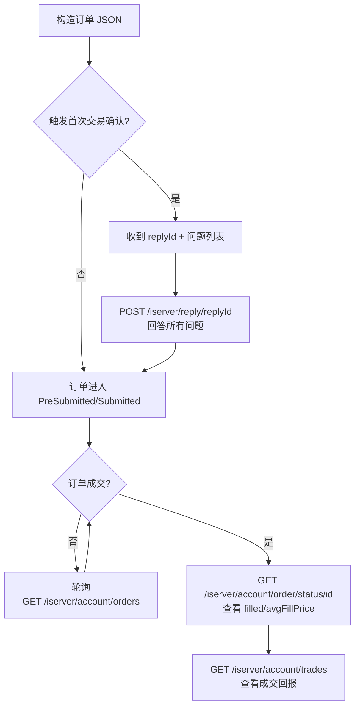

# 订单（Orders）

> **英文原文**：[Endpoints Explorer → Order](https://interactivebrokers.github.io/cpwebapi/endpoints) + [Use Cases → Order Operations](https://interactivebrokers.github.io/cpwebapi/use-cases) + [Use Cases → Bad Request Error](https://interactivebrokers.github.io/cpwebapi/use-cases)
> **翻译版本**：v1
> **译者**：@shalico2019

## 概述

Client Portal API 的"订单"分组覆盖下单、改单、撤单、Preview、状态查询等完整的下单生命周期。下表把所有相关端点列出来，便于按动作索引：

| 动作 | 方法 | 路径 |
| --- | --- | --- |
| 查活单 | GET | `/iserver/account/orders` |
| 下单 | POST | `/iserver/account/{accountId}/orders` |
| FA 账户下单 | POST | `/iserver/account/orders/{faGroup}` |
| 处理下单前的二次确认（券股 / 期权 / 期货） | POST | `/iserver/reply/{replyid}` |
| Preview（试算佣金 / 保证金） | POST | `/iserver/account/{accountId}/orders/whatif` |
| 查单笔订单状态 | GET | `/iserver/account/order/status/{orderId}` |
| 改单 | POST | `/iserver/account/{accountId}/order/{orderId}` |
| 撤单 | DELETE | `/iserver/account/{accountId}/order/{orderId}` |
| 成交回报 | GET | `/iserver/account/trades` |

> ⚠️ **前提**：与所有 `/iserver/...` 接口一样，必须先 [认证 + 切账户](./session.md)。下文中所有示例假定 `BASE = "https://localhost:5000/v1/api"`、`verify=False`（Gateway 用自签证书）。

## 1. `GET /iserver/account/orders` — 查活单

**注意**：这是**订阅型**调用——第一次调用建立订阅，**第二次**才会返回真实数据。官方建议**间隔 5 秒**。

```python
import time, requests
BASE = "https://localhost:5000/v1/api"

# 第一次：建立订阅
r1 = requests.get(f"{BASE}/iserver/account/orders", verify=False, timeout=5)
print(r1.json())  # 通常返回 []

# 等待订阅生效
time.sleep(5)

# 第二次：取真实数据
r2 = requests.get(f"{BASE}/iserver/account/orders", verify=False, timeout=5)
for o in r2.json():
    print(o["orderId"], o["symbol"], o["side"], o["orderType"], o["status"])
```

> **限频**：`/iserver/account/orders` 是 **1 req/5 secs**——**不要放进紧密循环**。

## 2. `POST /iserver/account/{accountId}/orders` — 下单

最核心的接口。请求体是 JSON 数组（注意是数组，每个元素是一笔订单）。

### 2.1 限价单示例（LMT，Limit Order，限价单）

```python
import requests
BASE = "https://localhost:5000/v1/api"

order = {
    "acctId": "DU1234567",
    "conid": 265598,                # 示例：AAPL 的 conid
    "cOID": "my-order-001",         # 自定义 ID，便于后续对账
    "orderType": "LMT",
    "price": 180.50,
    "quantity": 10,
    "side": "BUY",
    "tif": "DAY",                   # Time in Force：GTC / DAY / IOC / GTD ...
    "outsideRTH": False,            # 是否允许盘外成交
    "useAdaptive": False,
}

r = requests.post(
    f"{BASE}/iserver/account/DU1234567/orders",
    json=[order],                   # 注意：JSON 数组
    verify=False,
    timeout=10,
)
print(r.status_code, r.json())
```

响应通常是：

```json
[
  {
    "orderId": 86422312,
    "orderStatus": "PreSubmitted",
    "encryptMessage": "..."
  }
]
```

如果触发了 IBKR 的"下单前确认"机制（比如首次交易某只股票），`orderStatus` 会是 `PreSubmitted` 并附带一个 `replyId`，需要调用 `/iserver/reply/{replyid}` 二次确认。

### 2.2 市价单（MKT）

```python
order = {
    "acctId": "DU1234567",
    "conid": 265598,
    "orderType": "MKT",
    "side": "BUY",
    "quantity": 5,
    "tif": "DAY",
}
```

### 2.3 止损单（STP，Stop Order，止损单）

```python
order = {
    "acctId": "DU1234567",
    "conid": 265598,
    "orderType": "STP",
    "price": 170.00,          # 触发价
    "side": "SELL",
    "quantity": 10,
    "tif": "GTC",
}
```

### 2.4 止损限价单（STP LMT）

```python
order = {
    "acctId": "DU1234567",
    "conid": 265598,
    "orderType": "STP LMT",
    "price": 169.50,          # 触发后挂单价
    "auxPrice": 170.00,       # 触发价
    "side": "SELL",
    "quantity": 10,
    "tif": "GTC",
}
```

### 2.5 复杂单类型简表

| `orderType` | 含义 | 关键字段 |
| --- | --- | --- |
| `MKT` | 市价单 | — |
| `LMT` | 限价单 | `price` |
| `STP` | 止损单 | `price`（作为触发价） |
| `STP LMT` | 止损限价单 | `price`（挂单价）、`auxPrice`（触发价） |
| `REL` | 追踪止损单 | `auxPrice` |
| `TRAIL` | 跟踪止损单（按金额） | `auxPrice` |
| `BOX TOP` | 冰山单 | `quantity`、`displaySize` |
| `VWAP` / `MOC` / `LOC` | 算法单 / 收盘单 | 视具体类型而定 |

### 2.6 Combo 订单（组合单）

如果想做 spread / combo order，需要把 `conid` 换成 `conidex`，格式是：

```text
{spread_conid};;;{leg_conid1}/{ratio},{leg_conid2}/{ratio}
```

- `spread_conid`：组合合约的 IBKR 内部 ID。**美股期权**的 spread_conid **固定为 `28812380`**。
- `leg_conid` / `leg_conid`：每个 leg 的 conid。
- `ratio`：正数表示 long leg，负数表示 short leg。
- 非美股期权需要在前面拼 `conid@exchange`。

示例（来自 [Use Cases → Combo Orders](https://interactivebrokers.github.io/cpwebapi/use-cases)）：

```json
{
  "orders": [
    {
      "acctId": "DU*******",
      "conidex": "28812380;;;397534457/1,493186808/-1",
      "cOID": "84401484",
      "orderType": "LMT",
      "listingExchange": "",
      "outsideRTH": false,
      "price": 1.25,
      "side": "BUY",
      "ticker": "",
      "tif": "DAY",
      "referrer": "NO_REFERRER_PROVIDED",
      "quantity": 1,
      "isClose": false
    }
  ]
}
```

## 3. `POST /iserver/reply/{replyid}` — 二次确认

当下单触发 IBKR 的"首次交易 / 复杂证券确认"机制时，订单会停在 `PreSubmitted`，并要求回答一系列 yes/no 问题。需要在规定时间内（默认 30 秒）调用：

```python
import requests
BASE = "https://localhost:5000/v1/api"

# 假设 replyid 来自上一笔下单响应
r = requests.post(
    f"{BASE}/iserver/reply/1234567",
    json={"confirmed": True},
    verify=False,
    timeout=10,
)
print(r.json())
```

如果超时未确认，订单会被服务端自动取消。

## 4. `POST /iserver/account/{accountId}/orders/whatif` — Preview

下单前想知道"佣金多少 / 保证金变化 / 最大收益损失"，用 Preview：

```python
import requests
BASE = "https://localhost:5000/v1/api"

order = {
    "acctId": "DU1234567",
    "conid": 265598,
    "orderType": "LMT",
    "price": 180.50,
    "quantity": 10,
    "side": "BUY",
    "tif": "DAY",
}

r = requests.post(
    f"{BASE}/iserver/account/DU1234567/orders/whatif",
    json=[order],
    verify=False,
    timeout=10,
)
print(r.json())
```

返回形如：

```json
[
  {
    "amount": {
      "amount": 1805.00,
      "commission": 1.25,
      "total": 1806.25,
      "equity": 0.0,
      "margin": 905.0
    },
    "equity": {},
    "initial": { "current": 50000, "change": -905, "after": 49095 },
    "maintenance": { "current": 25000, "change": -452.5, "after": 24547.5 }
  }
]
```

## 5. `POST /iserver/account/{accountId}/order/{orderId}` — 改单

改单本质上是"再下一次单，但带上要修改的原 `orderId`"：

```python
import requests
BASE = "https://localhost:5000/v1/api"

modified = {
    "acctId": "DU1234567",
    "conid": 265598,
    "cOID": "my-order-001",
    "orderType": "LMT",
    "price": 182.00,           # 修改价格
    "quantity": 10,
    "side": "BUY",
    "tif": "DAY",
}

r = requests.post(
    f"{BASE}/iserver/account/DU1234567/order/86422312",
    json=modified,
    verify=False,
    timeout=10,
)
print(r.json())
```

## 6. `DELETE /iserver/account/{accountId}/order/{orderId}` — 撤单

```python
import requests
BASE = "https://localhost:5000/v1/api"

r = requests.delete(
    f"{BASE}/iserver/account/DU1234567/order/86422312",
    verify=False,
    timeout=10,
)
print(r.status_code, r.json())
```

> **常见错误码**：
>
> - `404 Not Found` —— `orderId` 不存在或已成交/已撤。
> - `422 Unprocessable Entity` —— 当前状态不允许撤单（比如已成交）。

## 7. `GET /iserver/account/order/status/{orderId}` — 单笔订单状态

```python
import requests
BASE = "https://localhost:5000/v1/api"

r = requests.get(
    f"{BASE}/iserver/account/order/status/86422312",
    verify=False,
    timeout=5,
)
print(r.json())
```

典型字段：

```json
{
  "orderId": 86422312,
  "status": "Filled",
  "filled": 10,
  "remaining": 0,
  "avgFillPrice": 180.62,
  "lastFillPrice": 180.62
}
```

## 8. `GET /iserver/account/trades` — 当日成交

> **限频**：`/iserver/account/trades` 是 **1 req/5 secs**。

```python
import requests
BASE = "https://localhost:5000/v1/api"

r = requests.get(f"{BASE}/iserver/account/trades", verify=False, timeout=5)
for t in r.json():
    print(t["tradeId"], t["symbol"], t["side"], t["quantity"], t["price"])
```

## 9. FA 账户下单

金融顾问（Financial Advisor，FA）账户支持按组下单：

```python
import requests
BASE = "https://localhost:5000/v1/api"

order = { ... }  # 同普通下单

r = requests.post(
    f"{BASE}/iserver/account/orders/equal",   # faGroup 示例：equal / pct_change / net_liq
    json=[order],
    verify=False,
    timeout=10,
)
```

`faGroup` 取值见官方文档，通常是 `equal`、`pct_change`、`net_liq` 等。

## 10. 下单流程图



## 与 TWS API 的差异

| 维度 | Client Portal API Orders | TWS API Orders |
| --- | --- | --- |
| 调用方式 | 一次 POST 提交完整订单 | 通过 `placeOrder()` 提交，并通过 `orderStatus` 回调 |
| 异步回调 | 无内建回调，需主动轮询 `/iserver/account/orders` | `orderStatus` / `execDetails` 实时推送 |
| Combo 订单 | 用 `conidex` 字符串（`28812380;;;leg/1,leg/-1`） | 通过 `Contract.comboLegs` 列表构造 |
| 撤单 | DELETE 单个端点 | `cancelOrder(orderId)` |
| Preview | `whatif` 端点单独存在 | 无原生等价接口（只能依赖 `whatIfOrder`） |

## 常见错误码

| HTTP Code | 含义 | 建议处理 |
| --- | --- | --- |
| `400 Bad Request` | JSON 含 `\r\n`、缺失必填字段、`acctId` 拼错 | 清理 JSON；对照 [Endpoints Explorer](https://interactivebrokers.github.io/cpwebapi/endpoints) |
| `401 Unauthorized` | session 失效 | 重新 `/iserver/reauthenticate` |
| `404 Not Found` | 订单 ID 不存在或已终态 | 重新拉 `/iserver/account/orders` |
| `422 Unprocessable Entity` | 数量 ≤ 0、价格非数字、购买力不足 | 检查 `quantity` / `price` / 资金 |
| `429 Too Many Requests` | 触发限频 | 严格 sleep 后重试 |
| `503 Service Unavailable` | Gateway 切换账户中或维护 | 等待 + 重试 |

## 下一节

- [行情（Market Data）](./market_data.md) — 下单前你需要先订阅行情才能拿到 conid 与最新价。

---

## 参考链接

- [Endpoints Explorer → Order](https://interactivebrokers.github.io/cpwebapi/endpoints)
- [Use Cases → Combo Orders](https://interactivebrokers.github.io/cpwebapi/use-cases)
- [Use Cases → Order updates](https://interactivebrokers.github.io/cpwebapi/use-cases)
- [Use Cases → Bad Request Error](https://interactivebrokers.github.io/cpwebapi/use-cases)
- [Session](./session.md)
- [账户](./account.md)
- [行情](./market_data.md)

## 修订记录

| 版本 | 日期 | 变更 |
| --- | --- | --- |
| v1 | 2026-06-09 | 首次翻译 |