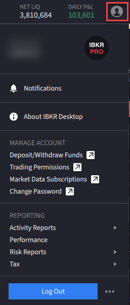

# 账户头像

> 原文：[ibkrguides.com/ibkrdesktop/account-avatar.htm](https://www.ibkrguides.com/ibkrdesktop/account-avatar.htm)
> 最后更新于 2025-10-07

## 概述

**账户头像图标（Account Avatar Icon）**位于 IBKR Desktop 主界面**右上角**，是你在 IBKR Desktop 中访问账户管理、报表、资金操作、退出登录等功能的统一入口。点击头像后会展开一个下拉菜单，每个菜单项对应一组相关操作——大多数项会跳转到盈透的 **Client Portal 网页端**完成对应流程。

!!! note "界面位置"
    账户头像图标是一个圆形图标，位于 IBKR Desktop 窗口**右上角**、搜索框右侧（与窗口设置、退出按钮在同一排）。

    

## 菜单项详解

点击账户头像后，下拉菜单中包含以下项：

### 1. Notifications（通知）

查看三类信息：

- **Market Alerts（行情警报）**：你设置过的价格 / 成交 / 时间类警报的触发记录
- **FYI Notifications（FYI 通知）**：盈透系统发出的提醒（如账户状态、风险提示等）
- **Notification Delivery Preferences（通知投递偏好）**：设置警报的发送渠道（应用内、邮件等）

### 2. About IBKR Desktop（关于 IBKR Desktop）

显示 IBKR Desktop 应用的**Java 版本**与**构建版本信息**——遇到问题时客服会要求你提供这个信息。

### 3. Deposit/Withdraw Funds（存取资金）

打开 Client Portal 的 **Transfer Funds**（资金转账）页面，进行**存款、取款、内部转账**等操作。

### 4. Trading Permissions（交易权限）

打开 Client Portal 的 **Trading Permissions** 页面，查看 / 申请可交易品种的权限（如某些期权级别需要单独申请）。

### 5. Market Data Subscriptions（行情订阅）

打开 Client Portal 的 **Market Data Subscriptions** 页面，订阅或退订各交易所的**实时行情**或**延时行情**。

### 6. Change Password（修改密码）

打开 Client Portal 的 **Change Password** 页面，修改你的盈透账户登录密码。

### 7. Activity Reports（活动报表）

三个子选项：

- **Activity Statement（活动对账单）**：查看账户综合对账单
- **Trade Confirmation Report（成交通知单）**：查看历史成交通知
- **Export Activity（导出活动）**：把账户活动导出为文件

三个选项都会打开 Client Portal 的 **Reporting** 报表页面。

### 8. Performance（业绩分析）

打开 Client Portal 的 **PortfolioAnalyst** 页面，查看投资组合的历史业绩、风险与归因分析。

!!! note "PortfolioAnalyst 是什么"
    PortfolioAnalyst 是盈透提供的统一业绩分析工具，整合账户内外的资产，按时间区间给出收益率、风险指标等。详见 [PortfolioAnalyst 在 TWS 中的章节](../tws-manual/portfolio-analyst.md)（Desktop 通过网页端访问同一服务）。

### 9. Risk Reports（风险报表）

三个子选项：

- **Margin Report（保证金报表）**：查看账户当前的保证金占用情况
- **Value at Risk Assessment（在险价值评估）**：基于统计方法的潜在损失估算
- **Stress Test（压力测试）**：模拟极端市场情景下的账户表现

三个选项都会打开 Client Portal 的 **Reporting** 报表页面。

### 10. Tax（税项）

两个子选项：

- **Tax Forms（税表）**：查看 / 下载历年税表（如 1099 等）
- **Tax Optimizer（税务优化器）**：分析可执行的税务优化操作（如税损收割等）

两个选项都会打开 Client Portal 的 **Tax Reports** 税表页面。

### 11. Log Out（退出登录）

**退出 IBKR Desktop**。点击后会立即结束当前会话。

!!! note "界面位置"
    **Log Out** 项位于下拉菜单的最底部，通常以红色或带分隔线的样式呈现，与其它项明显区分。

    

!!! warning "退出前注意"
    点击 **Log Out** 前请确认：
    - 当前没有未完成的挂单
    - 当前没有正在编辑但未保存的 Layout
    - 如果使用 IBKR Desktop + Client Portal 联动，Client Portal 网页端的会话**不会**自动退出（它是独立的网页登录）

## 关键要点

- **入口位置**：IBKR Desktop 主界面**右上角**圆形头像图标。
- **菜单结构**：11 个一级项，部分含子菜单（Activity Reports / Risk Reports / Tax）。
- **多数操作跳转 Client Portal**：存取资金、报表、税务、修改密码等操作都通过 Client Portal 网页端完成——Desktop 提供快捷入口，但实际页面是网页。
- **Performance 与 PortfolioAnalyst**：通过菜单项可一键访问盈透的业绩分析平台。
- **退出登录**：最底部的 **Log Out**，点击立即结束会话。
- **About IBKR Desktop**：版本与构建信息——报问题时第一时间告诉客服。

## 相关章节链接

- [入门概览](getting-started.md)：登录后第一步做什么
- [IBKR Desktop 简介](ibkr-desktop.md)：平台总览
- [下载与安装](download-software.md)：安装客户端

## 其他资源

- [IBKR Campus — IBKR Desktop 界面课程](https://ibkrcampus.com/trading-course/ibkr-desktop/)
- [IBKR Desktop 官网介绍页](https://www.interactivebrokers.com/en/trading/ibkr-desktop.php)

## 原文参考

- 源站 URL：https://www.ibkrguides.com/ibkrdesktop/account-avatar.htm
- 源站最后更新日期：2025-10-07
- 本章列举账户头像菜单的 11 个一级项；菜单结构相对稳定，但具体跳转的 Client Portal 页面布局可能随盈透网页端更新而调整。