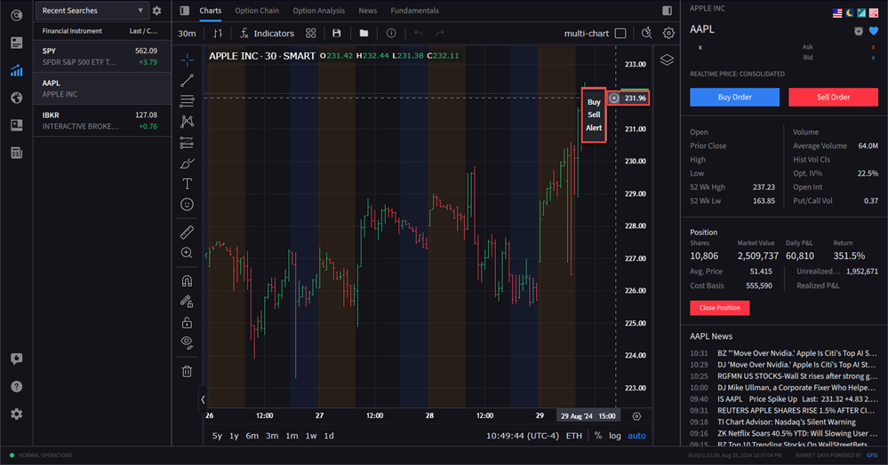
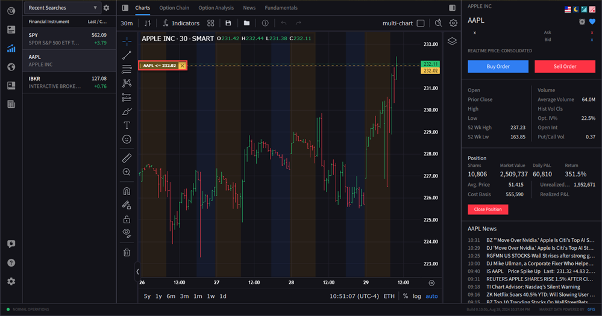
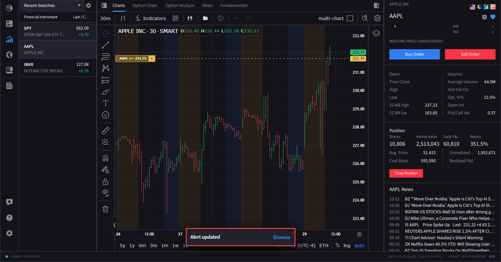
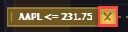
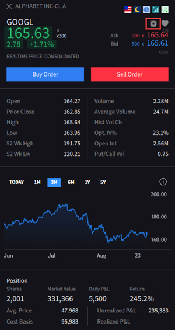
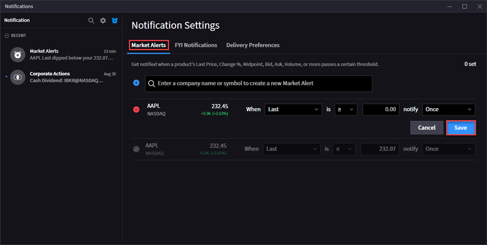

# 警报（Alerts）

> 原文：[ibkrguides.com/ibkrdesktop/alerts.htm](https://www.ibkrguides.com/ibkrdesktop/alerts.htm)

## 概述

**警报（Alerts）** 是当标的的**行情、时间或账户事件**触达预设条件时，向交易员发送**桌面通知**的机制。IBKR Desktop 的警报入口主要有两个：

- **图表警报（Chart Alerts）**：直接在图表上针对**价格水平**设置告警。
- **通知中心（Notification Center）**：从**行情详情（Quote Details）**面板创建和管理更结构化的 **Market Alerts（市场警报）**。

本章按源站章节顺序，先讲图表警报，再讲通知中心。

> 文档范围：源站 alerts.htm 章节覆盖的是**价格类**警报（chart 上以价格水平为触发条件 + Quote Details 的 Market Alerts）。**时间触发型（time-based）**和**成交触发型（fill-based）**警报在 IBKR 客户端中存在（TWS 端较常见），但本章节未涉及；如需，建议参考 TWS 使用手册的 Alerts 章节。

## 一、图表警报（Chart Alerts）

图表警报让交易员在**目标价格水平**上挂一个"标尺"——当市场价格穿越该水平时触发桌面通知。

### 1. 创建警报

1. 打开图表，将鼠标悬停在**价格刻度（Y 轴）**附近的目标价位上。
2. 在出现的**"+ 号"**图标上点击。

    !!! note "界面位置"
        图表右侧价格刻度（Y 轴）附近出现的小 **+** 号图标。点击后弹出包含 "Alert" 选项的菜单。

        

3. 在弹出的菜单中选择 **Alert（警报）**。
4. 警报被建立，触发方向取决于**所选价格相对当前市价的位置**：
   - **所选价 > 当前市价** → 价格**向上突破**该价时触发。
   - **所选价 < 当前市价** → 价格**向下跌破**该价时触发。
5. 图表上会出现一个**黄色方框（alert marker）**标识该警报。

    !!! note "界面位置"
        图表上会画出一条水平虚线 + 一个黄色方框（alert marker），表示警报已生效；触发方向由所选价位与当前市价的相对位置决定。

        

### 2. 修改警报

1. **点击并按住**黄色方框（alert marker），**上下拖动**到新价位。
2. 拖动结束后，**屏幕底部弹出消息**提示"警报已更新"。

    !!! note "界面位置"
        拖动黄色方框到底部屏幕会弹出"警报已更新"提示；同时图表上的水平虚线与方框随拖动即时移位。

        

> 注意：图表上的警报通过拖动改价后会立即更新触发价位，**不像图表内下单那样会重新发送订单**——仅修改触发条件，**不会**触发任何交易。

### 3. 取消警报

1. 点击警报**黄色方框右侧的 X 图标**。
2. 警报从图表上移除。

    !!! note "界面位置"
        黄色方框右侧的 **X** 小图标，鼠标悬停时会变成高亮；点击后立即从图表上移除该警报。

        

### 4. 警报通知的呈现

当警报触发时，**屏幕右下角弹出对话框**显示通知——这是警报触发后的统一反馈位置（无论从哪个窗格设置的警报，通知都汇聚到此处）。

## 二、通知中心（Notification Center）

通知中心用于**集中创建和管理**市场警报，入口在**行情详情（Quote Details）**面板。

### 1. 创建市场警报

1. 在 Quote Details 面板**右上角**点击**时钟图标**（clock icon）——这是进入 Notification Center 的入口。

    !!! note "界面位置"
        行情详情（Quote Details）面板**右上角**的时钟（clock）图标——该图标是进入 Notification Center 的统一入口，无论在哪个合约的 Quote Details 面板下都可用。

        

2. 屏幕中央弹出 **Notification Settings**（通知设置）窗口。
3. 在窗口中选择 **Market Alerts** 标签。
4. 在 Market Alerts 标签下，**搜索合约代码**，然后**填写警报参数**（方向、价格、有效期等）。

    !!! note "界面位置"
        Notification Settings 窗口中，**Market Alerts** 标签下方的搜索框 + 警报参数表单。常见字段：Symbol / Direction / Price / Expiration / Notify（推送方式）等。

        

5. 点击 **Save** 保存警报。

> 与图表警报的区别：图表警报**仅支持价格水平**这一种触发条件；Notification Center 的 Market Alerts 字段更结构化，便于批量管理。

### 2. 取消 / 删除警报

1. 在 Market Alerts 列表中找到目标警报。
2. 点击该行**左侧的减号（"-"）按钮**即可删除。

### 3. 查看所有警报通知

1. 切到 **Market Alerts** 标签即可看到该标签下所有警报的**当前状态**与**触发记录**。

## 三、警报触发的统一反馈

无论警报来自图表还是通知中心，**触发时的桌面通知都出现在屏幕右下角**——这是交易员需要重点关注的位置，建议把 IBKR Desktop 窗口放在第二屏或主屏的可视区域。

## 关键要点

- **图表警报仅支持价格水平**：要监控**时间触发**（"开盘前 10 分钟提醒"）或**成交触发**（"我的订单成交后通知"），需要 TWS 端或 Mobile IBKR 的更复杂警报类型；本章节不涉及。
- **拖动改警报 ≠ 重发订单**：图表上拖动 alert marker **仅修改触发价位**，**不会**触发任何交易行为；这与从图表内**下单**时拖动 Buy / Sell 框的行为**完全不同**。
- **警报跨平台同步**：与自选列表类似，警报在 IBKR Desktop、Client Portal 网页端之间**通常会同步**；但**具体同步行为以账户实际配置为准**。
- **桌面通知依赖系统设置**：如果系统级"勿扰模式"或 IBKR Desktop 的"通知中心"被关闭，触发时不会弹出对话框。

## 相关章节链接

- [图表（Charts）](chart.md)（图表警报所在窗格）
- [自选列表（Watchlist）](watchlists.md)（从自选列表可右键进入 Quote Details）
- [快速下单（Rapid Order Entry）](rapid-order-entry.md)
- TWS 使用手册中的 Alerts 章节（项目内 `docs/tws-manual/` 目录）——如需更复杂的警报类型。

## 原文参考

本章翻译基于以下源站：

- 主源页：[https://www.ibkrguides.com/ibkrdesktop/alerts.htm](https://www.ibkrguides.com/ibkrdesktop/alerts.htm)（"Alerts" 主章节，2025-10-07 更新）
- TOC 索引（MadCap Flare）：通过 `https://www.ibkrguides.com/ibkrdesktop/Data/Tocs/Primary_Chunk0.js` 反查，"alerts" 节点仅有 `/alerts.htm` 一条主条目，未挂载公开的子页面（图表警报与通知中心是源站按 H3/H4 切分的同级小节，不是独立 htm 页）。
- 引用图片：
    - `resources/images/alerts.png`（图表上点击 + 号并选择 Alert）
    - `resources/images/alerts1.png`（图表警报已建立，黄色方框标识）
    - `resources/images/alerts2.png`（拖动黄色方框修改警报）
    - `resources/images/alerts3.png`（黄色方框右侧的 X 取消图标）
    - `resources/images/alerts4.png`（Quote Details 面板右上角时钟入口）
    - `resources/images/alerts5.png`（Notification Settings 窗口的 Market Alerts 表单）

> 备注：源站未在本章中提供**时间触发 / 成交触发**警报的具体设置流程，相关能力以 TWS / Mobile IBKR 客户端文档为准。
