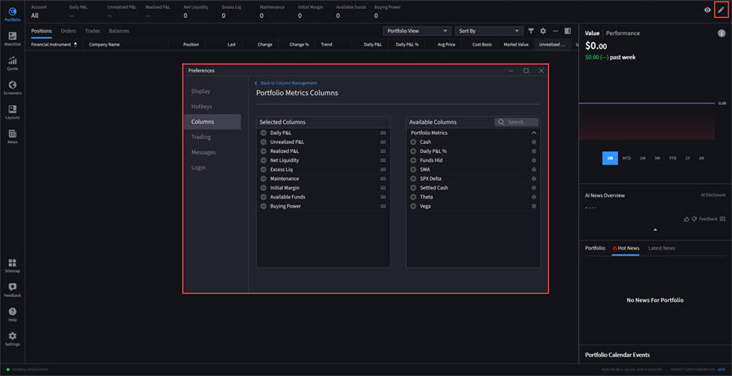

# Customize Portfolio Metrics（自定义组合指标）

> 原文：[ibkrguides.com/ibkrdesktop/customize-portfolio-metrics.htm](https://www.ibkrguides.com/ibkrdesktop/customize-portfolio-metrics.htm)
> 最后更新于 2025-10-07

## 概述

**Portfolio Metrics（组合指标）** 是 IBKR Desktop 在 Portfolio（持仓）页顶部展示的一组账户级与持仓级数据卡片，默认包含 **Net Liq（净流动资产）**、**Day P&L（当日盈亏）**、**Unrealized P&L（浮动盈亏）** 等关键数字。"Customize Portfolio Metrics" 提供**两个入口**让用户自由增删这些卡片显示的指标列——更适合自己的盯盘节奏。

!!! note "Customize 与 Portfolio 列自定义的区别"
    本章的"Customize Portfolio Metrics" 指的是 Portfolio 页面**顶部数据卡片**的自定义（Net Liq 等）。它**不是**底部持仓明细表（positions table）的列自定义——后者是另一个独立的"Portfolio Columns" 编辑器，入口不同（点击表头的列名 → Customize）。

---

## 操作步骤

**入口 A（推荐，顶部触发）：**

1. 在任意页面**顶部**，找到 **Net Liq 标签**。
2. 点击 Net Liq 标签**左侧的 `▼` 三角图标**（carrot icon / 雪佛龙图标）。
3. 弹出 Portfolio Metrics 自定义面板。

**入口 B（Portfolio 页面内触发）：**

1. 进入 **Portfolio** 页面。
2. 点击页面**右上角**的 **✏ 铅笔图标**（pencil icon）。
3. 弹出 Portfolio Metrics 自定义面板。

**添加新指标：**

1. 在自定义面板中找到 **Available Columns（可用指标列）** 区域。
2. 点击想要添加的指标**左侧的 `+` 号**，该指标会立即显示在 Portfolio 页面顶部。

!!! info "图片描述"
    - 图 1：页面顶部 Net Liq 标签，左侧有一个 `▼` 三角图标，点击后向下展开。

        
    - 图 2：Portfolio 页面右上角铅笔图标，位置在主表格区上方。

        
    - 图 3：展开后的自定义面板，左侧 "Available Columns" 列表中每行有 `+` 加号按钮；右侧 "Shown Columns" 列表中每行有 `×` 删除按钮。（源站未提供此图, 文字描述为主）

---

## 关键要点

- **Net Liq 的含义**：Net Liq = 现金 + 持仓市值（按当前价计算）— 保证金负债。**是 IBKR 衡量账户"净资产"的核心指标**，近似于账户净值。
- **常用可选指标**：
    - **Day P&L**：当日浮动盈亏，随市价变动。
    - **Unrealized P&L**：累计浮动盈亏（持仓未平仓部分）。
    - **Realized P&L**：已实现盈亏（已平仓部分）。
    - **Margin Used / Available**：已用 / 可用保证金。
    - **Buying Power**：购买力（受账户类型和监管法规约束）。
    - **Cash Balance**：现金余额。
- **添加后的位置**：新加的指标会**追加到 Net Liq 后面**（顶部数据卡片区），按添加顺序横向排列；卡片区放不下时会自动换行。
- **配置持久化**：自定义结果保存在**账户级别**（跟随账户而非设备），多端登录保持一致。
- **删除指标**：在自定义面板右侧 "Shown Columns" 区域，点击每项**右侧的 `×`** 即可删除；Net Liq 本身**不能删除**。
- **重置为默认**：自定义面板通常提供 "Reset to Default" 按钮，一键恢复原厂配置。
- **数据刷新频率**：卡片数据**随市价/账户状态实时变化**，**日内盯盘时盯 Net Liq 和 Day P&L 是最快的视角**。

---

## 相关章节

- [账户余额（Account Balances）](view-balances.md)——余额 / 保证力的详细数据
- [持仓（Portfolio）总览](view-positions.md)——Portfolio 主页面入口
- [业绩表现（Performance）](performance.md)——Portfolio 菜单的另一个标签页
- [IBKR Desktop 入门](ibkr-desktop.md)——面板与菜单的整体布局

---

## 原文参考

- 原文 URL：<https://www.ibkrguides.com/ibkrdesktop/customize-portfolio-metrics.htm>
- 最后更新：2025-10-07
- IBKR Campus 教学：<https://ibkrcampus.com/trading-course/ibkr-desktop/>
- IBKR Desktop 官网：<https://www.interactivebrokers.com/en/trading/ibkr-desktop.php>
