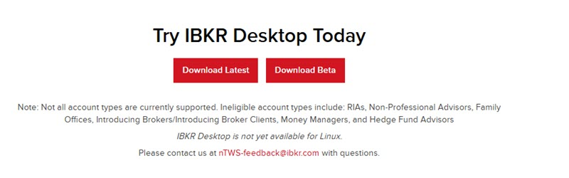
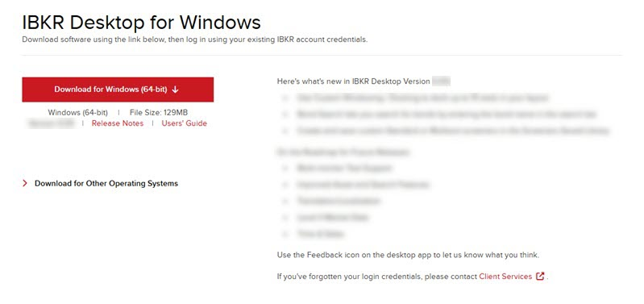

# 下载与安装

> 原文：[ibkrguides.com/ibkrdesktop/download-software.htm](https://www.ibkrguides.com/ibkrdesktop/download-software.htm)
> 最后更新于 2025-10-07

## 概述

本章介绍如何下载 IBKR Desktop 桌面客户端，并解释 **Latest 稳定版**与 **Beta 测试版**的区别，帮助你根据需求选择合适版本。

!!! note "系统要求"
    IBKR Desktop 官方仅支持 **Windows** 系统。Mac / Linux 用户可参考 [IBKR Desktop 简介](ibkr-desktop.md) 中的替代方案。

## 下载步骤

1. 打开 IBKR Desktop [官方下载页](https://www.interactivebrokers.com/en/trading/ibkr-desktop.php)。
2. 在页面中找到 **Download Latest**（最新稳定版）和 **Download Beta**（Beta 测试版）两个按钮，根据你的需求选择其中一个。
3. 选定版本后，再次点击 **Download** 按钮，开始下载该版本的安装程序。
4. 下载完成后，**双击**安装文件，按屏幕提示完成安装。

!!! note "界面位置"
    **Download Latest** 与 **Download Beta** 两个按钮位于下载页的 "Try It Now" 区域，两者上下排列；选定一个后再点击的 **Download** 按钮则在下一页中央。

## Latest 与 Beta 的区别

| 版本 | 含义 | 自动更新 | 适用人群 |
| --- | --- | --- | --- |
| **Download Latest（Latest 稳定版）** | 已经正式发布的**最新稳定生产版**，包含所有已上线的功能 | 登录时若有新 Latest 版发布，**自动更新** | 普通交易者、生产环境 |
| **Download Beta（Beta 测试版）** | **尚未正式发布**的内测版本，可能频繁变化 | 登录时若有新 Beta 版发布，**自动更新** | 高级用户、新功能尝鲜者、愿意反馈 Bug 的用户 |

!!! tip "选哪个？"
    大多数交易者选择 **Latest 稳定版**即可：功能稳定、经过测试、不会频繁变化。如果你希望提前体验新功能、能接受偶尔的 Bug，**Beta 版**也可以一试——并且 Beta 版在正式版发布后会**自动切换到最新稳定版**，不会一直停留在旧 Beta。

!!! warning "Beta 版的预期"
    Beta 版功能可能尚未完善、可能频繁更新、可能存在已知 Bug。**不建议在关键交易时段仅依赖 Beta 版**。

## 安装后下一步

下载并安装完成后：

1. 在 Windows 开始菜单或桌面快捷方式中找到 **IBKR Desktop** 图标并双击打开。
2. 使用你的盈透账户（**IBKR Account**）登录——首次登录会引导你完成一次性设置。
3. 登录后默认会进入一个简洁的**单一工作区布局（Layout）**，你可以根据需要添加面板（Pane）：投资组合（Portfolio）、自选列表（Watchlist）、图表（Chart）等。

详细登录与首启流程见后续章节。

## 关键要点

- **下载入口**：[IBKR Desktop 官方下载页](https://www.interactivebrokers.com/en/trading/ibkr-desktop.php) 的 **Try It Now** 区域。
- **Latest vs Beta**：Latest 是稳定生产版，Beta 是内测尝鲜版——两者都会在登录时自动更新。
- **仅 Windows**：官方只提供 Windows 版本。
- **安装简单**：双击安装包、按提示完成，登录即可使用。
- **登录后第一步**：登录后会进入一个默认 Layout，可以从右上角账户头像开始熟悉界面。

## 相关章节链接

- [IBKR Desktop 简介](ibkr-desktop.md)：平台总览与覆盖范围
- [入门概览](getting-started.md)：登录后第一步做什么
- [账户头像](account-avatar.md)：右上角账户菜单
- [合约搜索](contract-search.md)：如何找到并打开第一个可交易品种

## 其他资源

- [IBKR Campus — IBKR Desktop 界面课程](https://ibkrcampus.com/trading-course/ibkr-desktop/)
- [IBKR Desktop 官网介绍页](https://www.interactivebrokers.com/en/trading/ibkr-desktop.php)

## 原文参考

- 源站 URL：https://www.ibkrguides.com/ibkrdesktop/download-software.htm
- 源站最后更新日期：2025-10-07
- 本章为下载入口与版本选择说明；具体安装流程按操作系统的标准安装向导进行。