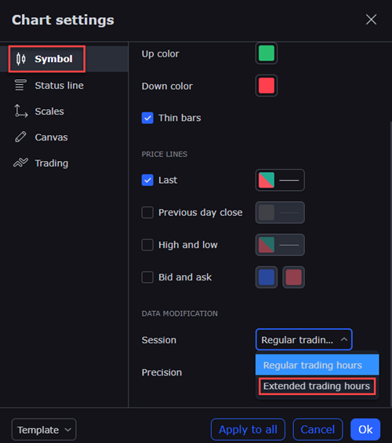
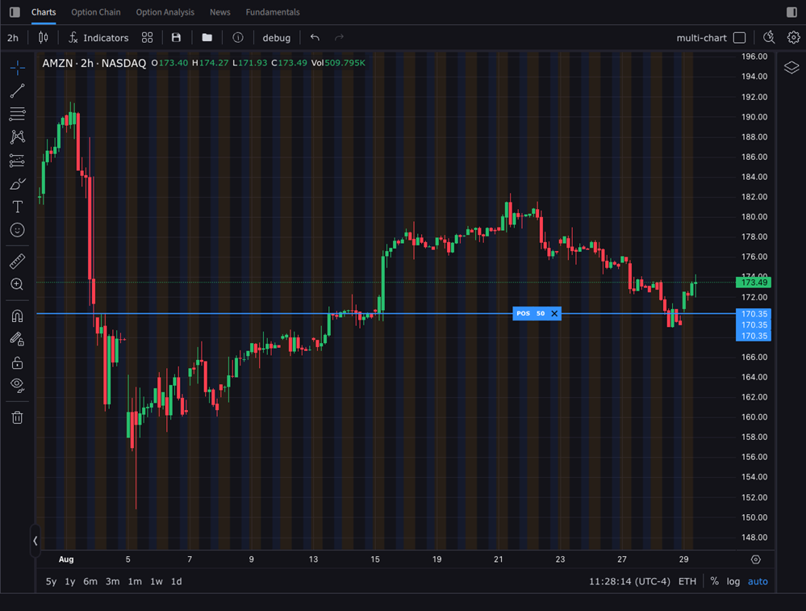
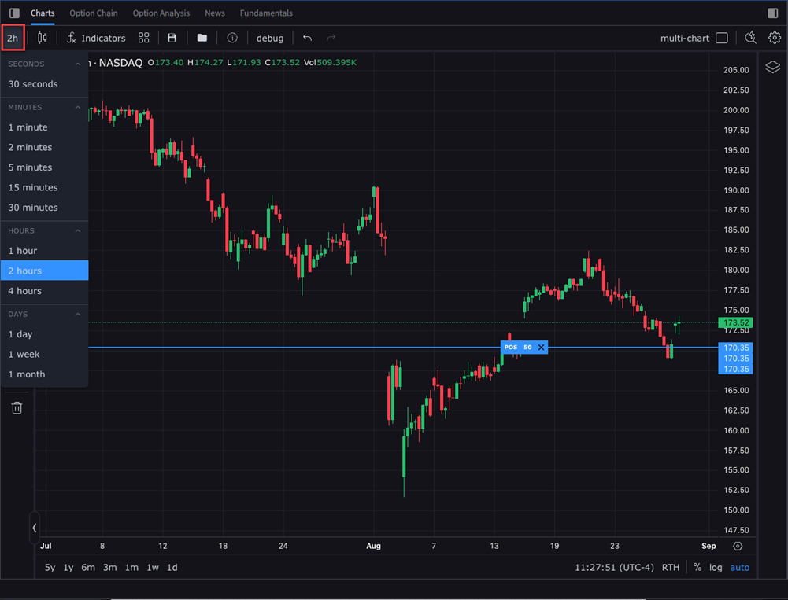
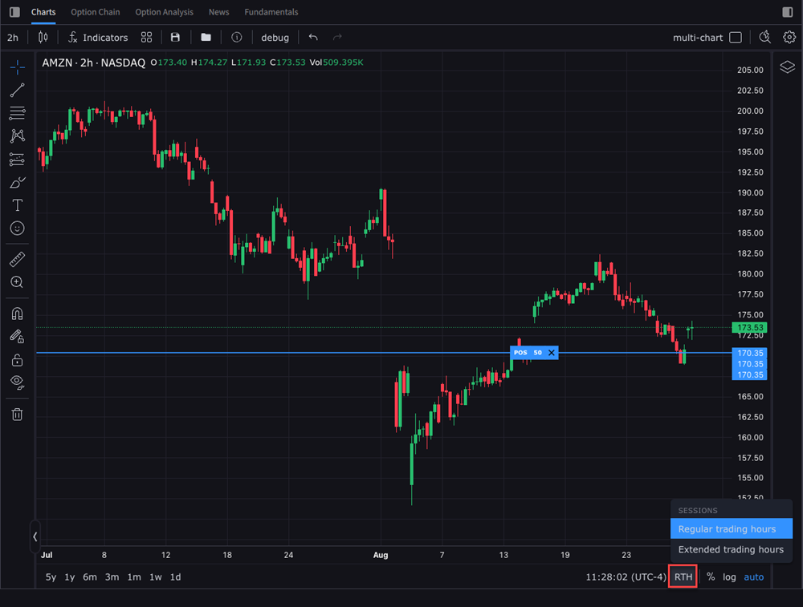

# 扩展交易时段（Extended Trading Hours）

> 原文：[ibkrguides.com/ibkrdesktop/extended-trading-hours.htm](https://www.ibkrguides.com/ibkrdesktop/extended-trading-hours.htm)
> 最后更新于 2025-10-07

**扩展交易时段（Extended Trading Hours, ETH）** 包含 **盘前（Pre-Market）** 与 **盘后（After-Hours）** 两个时段。IBKR Desktop 图表默认仅显示**常规交易时段（Regular Trading Hours, RTH）**数据；启用 ETH 后图表上会渲染**两段延伸区间**并用**独立背景色**区分，便于交易员在美股盘前发布的财报、隔夜海外市场波动、盘后业绩指引等事件发生时观察价格行为。

!!! info "适用范围"
    ETH 显示功能**仅对日线以下周期**（分钟、小时等）有效。**日线及更长周期**图表请使用图表头部工具栏中的**时钟图标**打开"Outside RTH"开关（详见 [Chart Summary](https://www.ibkrguides.com/ibkrdesktop/charts-summary.htm#Outside_RTH)（源站链接））。

## 适用场景

- 美股盘前**财报 / 业绩指引**发布前后的价格发现。
- 隔夜**海外市场（欧股、亚股）**联动对相关美股的影响。
- 盘后机构大宗交易 / 流动性异常监测。

---

## 操作步骤

1. 点击 IBKR Desktop 左侧 **Quote 菜单**图标  打开图表区。

    !!! note "界面位置"
        Quote 图标固定在主窗口左侧导航栏，是打开图表区（Chart）的入口之一。

2. 在图表设置入口二选一：

    - 点击右上角 **Configure 齿轮图标** 打开设置窗口；

        

    - 或在图表区**右键单击**，在菜单中选择 **Settings（设置）**。

        

3. 在 **Chart Settings 窗口**左侧选择 **Symbol（合约）** 选项卡，向下滚动到底部，找到 **Session（交易时段）** 下拉菜单。

4. 在下拉菜单中点击 **Extended Trading Hours（扩展交易时段）**。

    !!! note "Session 选项"
        Session 下拉菜单通常包含 **RTH / ETH / Custom** 三档。ETH = Pre-Market + After-Hours 合并显示；Custom 可手动指定起止时间。

        

5. （可选）通过 **Pre/post market hours background** 调色板为盘前 / 盘后时段**设置背景色**——便于在视觉上快速区分 ETH 与 RTH 区间。

6. 点击 **Ok（确定）** 保存设置。

7. 图表重新加载，盘前 / 盘后区间以**色块背景**叠加在 K 线主图上。

    !!! note "图表识别"
        启用 ETH 后，盘前 / 盘后区段会以**独立背景色**（默认浅灰色）叠加在 K 线主图上，与 RTH（常规交易时段）形成视觉区分——便于一眼识别价格行为发生在哪一段。

        

8. 通过**左上角时间图标**切换 K 线周期（1m / 5m / 15m / 1h 等）。

    !!! note "界面位置"
        时间图标位于图表工具栏**左上角**，用于切换图表聚合周期（1m / 5m / 15m / 1h / 1d 等）。

        

9. 通过**右下角图标**在 **ETH（扩展交易时段）** 与 **RTH（常规交易时段）** 之间**切换**显示——快速对照"全时段图"与"仅常规时段图"。

    !!! note "临时切换 vs 设置"
        右下角图标是**临时切换**工具——不改合约级 ETH 设置，只控制当前图表显示。适合快速对照"全图 vs 仅 RTH"，不影响下次打开同一合约的默认行为。

        

---

## 关键要点

- **仅日线以下周期有效**：日线 / 周线 / 月线周期**不会**显示 ETH 段；如需显示，按源站说明改用图表头部的时钟图标（"Outside RTH"）。
- **独立背景色**：盘前 / 盘后用**独立背景色**与 RTH 区分——颜色可自定义，便于团队内部统一识别约定。
- **快速切换 ETH/RTH**：右下角图标是**临时切换**工具，不改设置——快速比较"全图"与"只 RTH"图。
- **流动性差异**：ETH 段**流动性远低于** RTH，价差（spread）大、滑点高、跳空频繁——技术指标在 ETH 段**失真**更明显。
- **数据源**：ETH 数据来自 IBKR 的扩展时段行情订阅，**部分品种**可能因订阅等级或交易所规则**不提供** ETH；遇到图表只显示 RTH 段，请到 Account → Market Data Subscriptions 检查。
- **设置作用域**：Session / Background 颜色是**合约级**设置——不同合约的 ETH 配置互相独立，切换合约不会继承。

---

## 相关章节

- [图表总览（Chart）](chart.md)
- [图表技术指标（Chart Indicators）](chart-indicators.md)
- [图上下单（Transmit Orders in Chart）](transmit-orders-chart.md)
- [持仓与均价线（Position with Average Price）](position-with-average-price.md)

---

## 原文参考

本章翻译基于以下源站：

- 主源页：[ibkrguides.com/ibkrdesktop/extended-trading-hours.htm](https://www.ibkrguides.com/ibkrdesktop/extended-trading-hours.htm)（"Extended Trading Hours" 章节，2025-10-07 更新）
- 引用图片清单（与源站步骤一一对应）：
    - `quote-icon.png` — Quote 菜单图标（步骤 1）
    - `extended-trading.png` — Configure 齿轮（步骤 2，右上角入口）
    - `extended-trading1.png` — 右键 Settings 菜单（步骤 2，右键入口）
    - `extended-trading2.png` — Session 下拉选 ETH（步骤 4）
    - `extended-trading-hours.png` — 启用 ETH 后的 K 线（步骤 7）
    - `extended-trading3.png` — 时间图标（步骤 8）
    - `extended-trading4.png` — ETH / RTH 切换图标（步骤 9）

!!! note "图数对账"
    源站实际 7 张图 / 译稿占位 7 张 / 本次嵌入 7 张——全部 1:1 替换，无新增、无缺失。

- 源站当前返回 200 OK，本翻译对应 **Last updated on October 7, 2025** 版本。