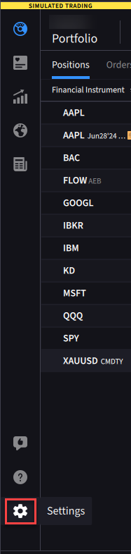
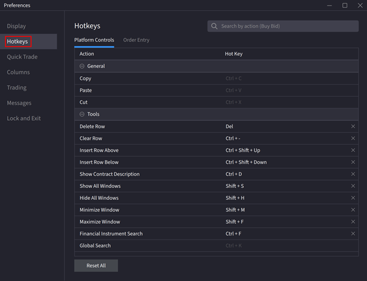
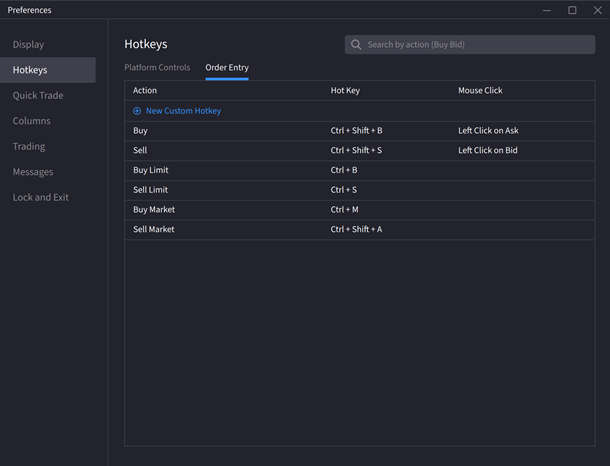
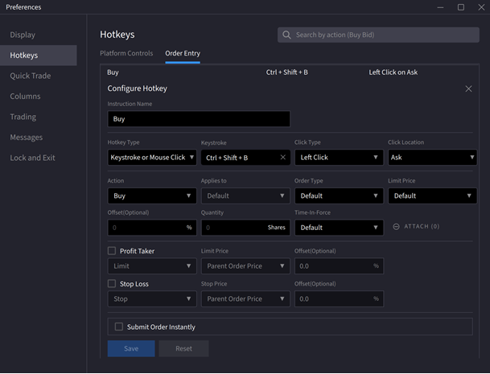

# 快捷键

> 原文：[ibkrguides.com/ibkrdesktop/hot-keys.htm](https://www.ibkrguides.com/ibkrdesktop/hot-keys.htm)
> 最后更新于 2025-10-14

## 概述

**快捷键（Hot Keys）** 是 IBKR Desktop 内置的"按键触发下单"机制——你把任意**按键**或 **Ctrl / Shift + 字母键的组合**绑定到具体的下单动作（如买、卖、提交、取消），实现**一键下单**。

它适合：

- **高频手动交易者**：盯盘时需要几毫秒级下单，不想用鼠标点 Order Ticket
- **剥头皮 / 抢帽子（Scalper）**：市场快速波动时抢速度
- **量化手动版**：用快捷键取代部分算法下单逻辑

## 操作步骤

1. **打开设置面板**：点击右上角 / 主界面顶部的 **Settings（设置）** 图标（齿轮形状），弹出设置窗口。

    !!! note "界面位置"
        主界面右上角 / 顶部导航栏中的齿轮状 **Settings** 图标。点击后弹出设置窗口。

        

2. **切换到 Hotkeys 标签**：在设置窗口中点击 **Hotkeys** 标签页。这里列出现有所有快捷键定义。

    !!! note "界面位置"
        Settings 窗口顶部标签栏中的 **Hotkeys** 标签。点击后进入快捷键列表页，可查看现有所有快捷键定义。

        

3. **删除或编辑快捷键**：

    - **删除**：点击快捷键**右侧的灰色 × 图标**，从列表中移除。
    - **编辑**：点击该快捷键对应的 **Hot Key** 单元格，直接用键盘按下新组合键即可。

4. **配置下单（Order Entry）快捷键**：点击设置窗口顶部的 **Order Entry** 标签，进入下单相关快捷键配置区。这里专门定义"按某键 = 在当前激活标的下一笔特定类型的订单"。

    !!! note "界面位置"
        设置窗口顶部标签栏中的 **Order Entry** 标签（与 Hotkeys 标签并列）。点击后进入下单类快捷键配置区，列出当前所有与下单相关的快捷键条目。

        

5. **填写快捷键参数**：点击某个现有快捷键进入编辑模式，使用**下拉菜单**调整参数：

    | 字段 | 说明 |
    |------|------|
    | **Action** | 动作：Buy（买）/ Sell（卖） |
    | **Hotkey Type** | 快捷键类型：Order（下单）/ Cancel（撤单）等 |
    | **Keystroke** | 触发的按键 |
    | **Quantity** | 下单数量 |
    | **其他参数** | 价格类型（限价/市价）、TIF 等订单属性 |

    !!! note "界面位置"
        点击 Order Entry 标签下某个现有快捷键条目后展开编辑面板，可见 **Action / Hotkey Type / Keystroke / Quantity** 等下拉菜单字段，用于调整该快捷键的具体下单参数。

        

6. **（可选）开启自动提交**：勾选 **Submit Order Instantly**（立即提交订单）选项，触发快捷键时**跳过订单确认弹窗**，直接成交。

    > ⚠️ **风险提示**：开启"立即提交"后，**没有二次确认环节**——误触 = 真金白银的下单。请确认无误后再勾选。

## 关键要点

- **支持的按键**：任意按键，或 **Ctrl / Shift + 26 个字母键的组合**。
- **支持的动作**：买、卖、提交、撤单等订单生命周期命令。
- **Order Entry 标签**：专门用于下单类快捷键（区别于通用 Hotkeys 标签的全局热键）。
- **立即提交**（Submit Order Instantly）：一键直达交易所，**无二次确认**——慎用。
- **冲突避免**：同一按键建议只绑定一个动作；冲突时后绑定的覆盖前者。

## 常用快捷键参考表

> **本表为译者基于源站参数结构整理的"常见下单配置模板"**，源站本身未列出具体推荐组合，请按个人交易风格调整。

| 用途 | 按键 | 动作 | 数量 | 类型 |
|------|------|------|------|------|
| 市价买入 | `Ctrl+B` | Buy | 当前持仓的 1 倍 | Market |
| 市价卖出 | `Ctrl+S` | Sell | 当前持仓的 1 倍 | Market |
| 平仓 | `Ctrl+Shift+C` | Sell | 全部 | Market |
| 限价买入 | `Alt+B` | Buy | 默认数量 | Limit（默认价） |
| 限价卖出 | `Alt+S` | Sell | 默认数量 | Limit（默认价） |
| 撤单 | `Ctrl+Z` | Cancel | — | — |

> 以上为示例。Order Entry 标签下可任意组合 Action / Hotkey Type / Quantity / Keystroke。

## 相关章节链接

- [设置](settings.md)（快捷键是设置面板的一项）
- [快速下单](rapid-order-entry.md)（鼠标下单的标准流程）
- [高级订单](advanced.md)（订单类型与 TIF 等参数）
- [订单预设（源站链接）](https://www.ibkrguides.com/ibkrdesktop/order-presets.htm)（预设订单参数，与快捷键配合使用）

## 其他资源

- [IBKR Campus — Hotkeys 课程](https://ibkrcampus.com/trading-lessons/ibkr-desktop-hotkeys/)
- [IBKR Desktop 官网介绍](https://www.interactivebrokers.com/en/trading/ibkr-desktop.php)

## 原文参考

- 源站 URL：https://www.ibkrguides.com/ibkrdesktop/hot-keys.htm
- 源站最后更新日期：2025-10-14
- 截图：源站含 4 张截图（Settings 菜单入口 `settings.png` / Hotkeys 标签 `hotkeys1.png` / Order Entry 标签 `hotkeys2.png` / 快捷键参数编辑 `hotkeys3.png`），均为 IBKR Desktop 官方 UI 截图；本译本已全部嵌入对应步骤下方。
- 信息缺口：源站**未给出"IBKR Desktop 默认快捷键列表"**——上方"常用快捷键参考表"为译者整理的常见配置模板，**非源站官方推荐**；请以 IBKR Desktop UI 中实际显示的快捷键为准。