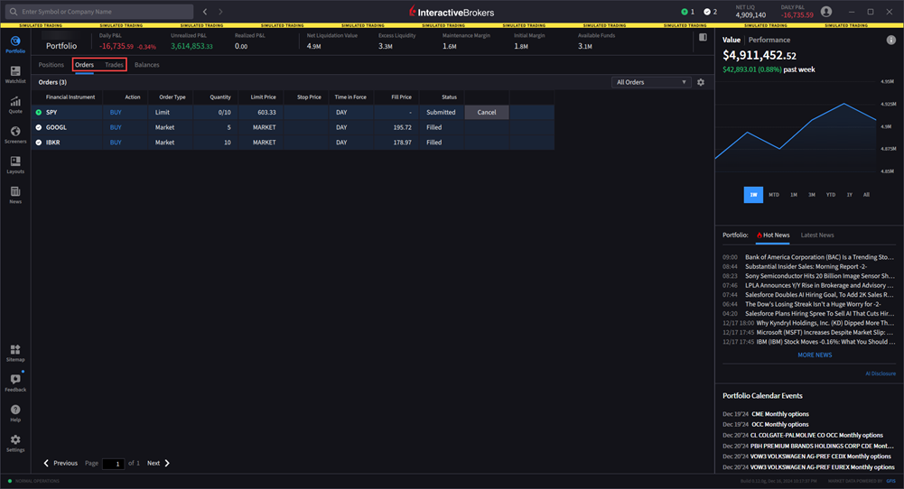
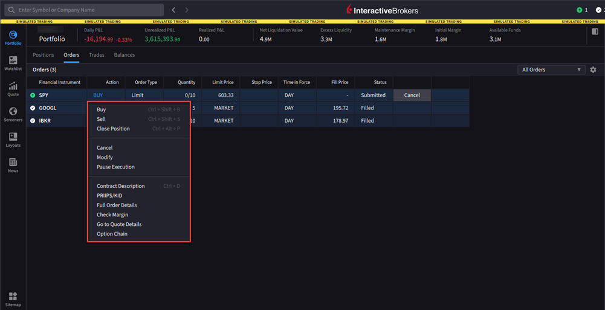
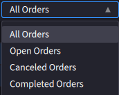
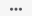

# 订单与成交（Orders & Trades）

> 原文：[ibkrguides.com/ibkrdesktop/orders-and-trades.htm](https://www.ibkrguides.com/ibkrdesktop/orders-and-trades.htm)
> 最后更新于 2025-10-07

## 概述

**Orders（订单）** 与 **Trades（成交）** 是 IBKR Desktop Portfolio 面板下的两个相邻标签页，分别展示"还在挂的订单"和"已执行的成交记录"。你可以从 Portfolio 菜单进入，按以下步骤操作。

!!! info "对照 TWS"
    TWS Mosaic 中等价的视图是 **Monitor Panel → Activity 标签页**（Orders / Trades 子标签）。IBKR Desktop 把它们合并到 **Portfolio → Orders / Trades** 两个标签页——切换更直接，**不需要在 Activity 内部再点子标签**。

!!! note "界面位置"
    主窗口 **左上角 Portfolio 图标** → 顶部 **Orders** 或 **Trades** 标签页。

---

## 操作步骤

1. 点击主界面**左上角**的 **Portfolio** 菜单图标（一个小折线图样图标）。

    !!! note "界面位置"
        Portfolio 图标固定在主窗口左上角，任何页面都能进入。

        

2. 点击 **Orders** 或 **Trades** 标签页。

    !!! note "界面位置"
        Portfolio 面板顶部有 4 个标签页（Positions / Orders / Trades / Balances）。Orders 显示**尚未成交**的活动订单；Trades 显示**已经成交**的历史成交。

        

3. **Orders 标签页显示活动订单（working orders）**，**Trades 标签页显示已执行成交（executed trades）**——两个标签页数据是分开统计的，不要混淆。

    !!! tip "如何判断一条订单是 Orders 还是 Trades"
        - **Orders（订单）**：状态为 Working / PendingSubmit / PreSubmitted / ApiPending——还没完全成交或被撤销
        - **Trades（成交）**：订单已经至少部分成交（Filled）或全部成交——出现在 Trades 标签页意味着"这单已经发生"

4. 在 Orders 标签页上**右键一条活动订单**，可以显示额外的操作菜单。

    !!! note "界面位置"
        Orders 列表中任意一条订单上右键 → 弹出菜单常见选项：**取消订单（Cancel Order）**、**修改订单（Modify Order）**、**复制为新单（Clone / Duplicate）**、**查看订单详情（View Order）** 等。

        

5. 点击 **All Orders（全部订单）下拉菜单** 选择额外的过滤条件——例如"只看今天"、"只看已成交"、"只看已撤销"等。

    !!! note "界面位置"
        Orders 标签页顶部有一个 "All Orders" 下拉框。常见过滤项：All（全部）、Today's Orders（今天）、Active（活动）、Filled（已成交）、Cancelled（已撤销）、Triggered（已触发）等。

        

6. 点击 **Filter（漏斗图标）**，按代码（symbol）和/或资产类型（asset type）过滤。

    !!! note "界面位置"
        Orders / Trades 标签页顶部的漏斗形 Filter 图标 。

7. 使用 **More（更多菜单）**  设置 **Show Zero Positions（显示零持仓）** 和/或 **Show Cash Rows（显示现金行）**——便于核对当日已平仓头寸对应的成交。

---

## Orders 标签页的核心字段

| 字段 | 含义 |
|------|------|
| **Symbol** | 合约代码 |
| **Quantity** | 数量（正数=买入，负数=卖出） |
| **Order Type** | 订单类型（MKT / LMT / STP / STP LMT / TRAIL 等） |
| **Price** | 下单价格（限价单才有） |
| **TIF (Time in Force)** | 订单有效期（DAY / GTC / IOC / FOK / GTD 等） |
| **Status** | 当前状态（Working / Filled / Cancelled / Pending 等） |
| **Filled / Remaining** | 已成交量 / 未成交量 |
| **Avg Price** | 成交均价（部分成交后才有） |
| **Submitted Time** | 提交时间 |
| **Order ID** | 订单唯一编号（IBKR 内部 ID） |

---

## Trades 标签页的核心字段

| 字段 | 含义 |
|------|------|
| **Symbol** | 合约代码 |
| **Quantity** | 本次成交的数量 |
| **Price** | 本次成交价格 |
| **Execution Time** | 成交时间戳（精确到毫秒） |
| **Commission** | 本次成交的手续费 |
| **Realized P&L** | 本次成交已锁定的已实现盈亏（**仅对**平仓部分有意义） |
| **Trade ID** | 成交唯一编号 |

!!! tip "对照 TWS"
    TWS Activity 标签页中 Realized P&L 字段默认**不显示**——需要在 Configure 里勾选。IBKR Desktop 默认显示，便于快速核对当日盈亏。

---

## 关键要点

- Orders 和 Trades 是**两个独立的数据视图**——同一条订单如果部分成交，会在 Orders（剩余部分）+ Trades（已成交部分）**同时出现**。
- **右键订单**是最快的批量操作方式——比"找到订单 → 双击 → 修改 → 确认"快得多。
- **All Orders 下拉**比"全局过滤器"更精确——它直接控制状态集合，而不影响其他过滤。
- 已成交的 Trades 是**不可修改的**——如果发现成交有问题，正确的做法是反向开仓（平仓/对冲），而不是尝试修改成交。

!!! warning "对照 TWS 的关键差异"
    - TWS Mosaic 的 Orders 标签页支持**父子订单嵌套展示**（如 Bracket Order / Attached OCA）；IBKR Desktop 默认**平铺展示**父子订单为多行
    - TWS 中可以用 **Ctrl+点击多选订单**批量取消；IBKR Desktop 中**多选支持的实现方式**略有差异（具体以界面为准）
    - TWS 的 Trade 标签页不显示 Realized P&L 默认值；IBKR Desktop **默认显示**

---

## 相关章节

- [投资组合入口（Portfolio 菜单）](portfolio-icon.md)
- [查看持仓（Positions）](view-positions.md)
- [查看余额（Balances）](view-balances.md)
- [快速下单（Rapid Order Entry）](rapid-order-entry.md)
- [高级订单（Advanced Orders）](advanced.md)
- [算法交易（Algorithmic Trading）](algorithmic-trading.md)
- TWS 对照：[TWS 订单管理（Order Management）](../tws-manual/order-management.md)
- 外部：[IBKR Campus - IBKR Desktop Interface](https://ibkrcampus.com/trading-course/ibkr-desktop/)
- 外部：[IBKR Desktop 产品页](https://www.interactivebrokers.com/en/trading/ibkr-desktop.php)

---

## 原文参考

- 原文 URL：<https://www.ibkrguides.com/ibkrdesktop/orders-and-trades.htm>
- 最后更新：2025-10-07
- 引用图片：
    - `resources/images/portfolioicon.png`（Portfolio 菜单图标）
    - `resources/images/orders-and-trades.png`（Orders / Trades 标签页总览）
    - `resources/images/orders-and-trades1.png`（右键活动订单的菜单）
    - `resources/images/orders-and-trades2.png`（All Orders 下拉菜单）
    - `resources/images/filter-icon.png`（Filter 漏斗图标）
    - `resources/images/more-menu-icon.png`（More 菜单图标）
