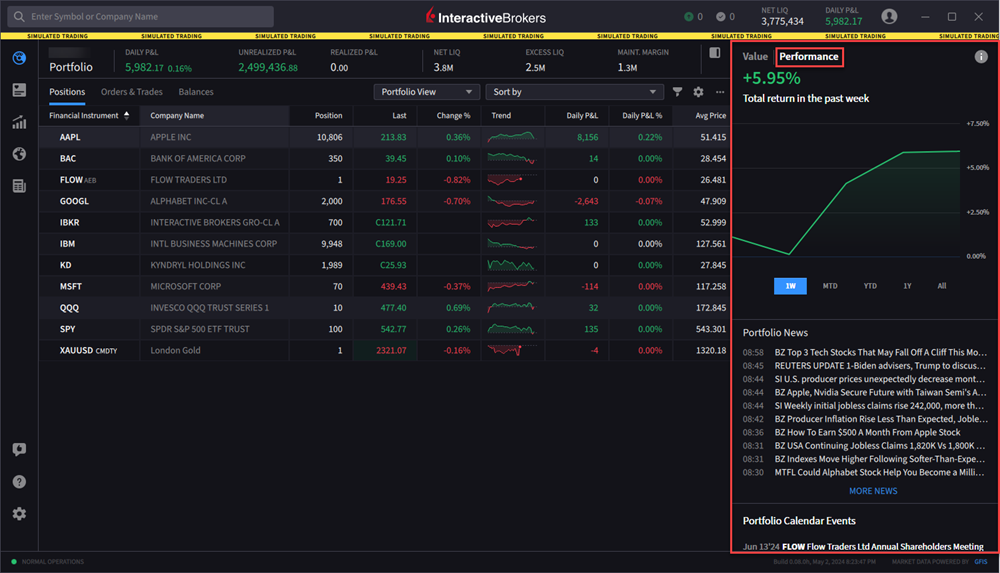

# Performance（业绩表现）

> 原文：[ibkrguides.com/ibkrdesktop/performance.htm](https://www.ibkrguides.com/ibkrdesktop/performance.htm)
> 最后更新于 2025-10-07

## 概述

**Performance（业绩表现）** 是 Portfolio（持仓）菜单下的一个标签页，集中展示三类信息：

- **Portfolio News（持仓相关新闻）**：与你当前持仓相关的新闻流。
- **Portfolio Calendar Events（持仓相关日历事件）**：财报、股东大会、分红、除权等即将发生的事件。
- **Portfolio Performance Chart（持仓业绩曲线）**：以**时间加权回报（Time-Weighted Return, TWR）** 衡量的组合表现——**消除入金/出金影响后，单位时间内的纯收益率**。

!!! note "TWR 与简单收益率的区别"
    TWR（Time-Weighted Return，时间加权回报）**剥离了入金/出金对组合涨跌的稀释效应**，专门用于评估"投资决策本身"的质量。如果你在某次大跌前大幅入金，简单总回报会被新入金"摊薄"而虚低，TWR 不会。机构客户在评估基金经理业绩时**几乎只用 TWR**，IRR（资金加权）作为补充。

---

## 操作步骤

1. 点击屏幕**左上角**的 **Portfolio 菜单图标**（一个带横杠/文件夹样式的图标）。
2. 进入 Portfolio 页面后，在页面**右侧**找到 **Performance 标签页**并点击。
3. 向下滚动页面，依次查看 Portfolio News、Portfolio Calendar Events、Portfolio Performance Chart。
4. （可选）滚动到 Portfolio Calendar Events 区域时，**继续向下滚动可加载更多事件**。

---

## 关键要点

- **TWR 的解读要点**：TWR 把整个考察期拆成若干子区间，**每个子区间内单独计算收益率再几何连乘**，规避了大额入金/出金对区间回报率的扭曲。**TWR 高 ≠ 实际赚的钱多**（还取决于资金规模），**TWR 衡量的是"策略本身的水平"**。
- **业绩曲线的可调参数**：Desktop 的 Performance Chart 通常提供时间范围（1M / 3M / 6M / YTD / 1Y / All）切换；切换后 TWR 曲线自动重算。
- **业绩与基准对比**：Desktop 的 Portfolio Performance 侧重"自己看自己"；**如果需要把组合业绩与 S&P 500 等指数做基准对比，应使用 PortfolioAnalyst**（账户管理模块，可从 TWS 入口打开）。
- **News / Calendar 来源**：持仓相关新闻与日历事件**直接来自 IBKR 的市场数据服务**（基础订阅可用，财报/分红等结构化事件为通用数据，深度新闻需要订阅权限）。
- **日报 vs. 复盘**：Portfolio Performance Chart 适合"快速看一眼今天/这周/这个月组合表现如何"；如果要做月度/季度复盘、税务准备，**导出到 PortfolioAnalyst 做完整报告**更合适。

---

## 相关章节

- [持仓（Portfolio）总览](view-positions.md)——Portfolio 菜单的入口
- [账户余额（Account Balances）](view-balances.md)——同一菜单下的财务指标
- [投资组合分析（PortfolioAnalyst）](../tws-manual/portfolio-analyst.md)——基准对比、PDF 报告等深度功能
- [TWS 入门概览](../tws-manual/getting-started.md)——从 TWS 打开 PortfolioAnalyst

---

## 原文参考

- 原文 URL：<https://www.ibkrguides.com/ibkrdesktop/performance.htm>
- 最后更新：2025-10-07
- IBKR Campus 教学：<https://ibkrcampus.com/trading-course/ibkr-desktop/>
- IBKR Desktop 官网：<https://www.interactivebrokers.com/en/trading/ibkr-desktop.php>
