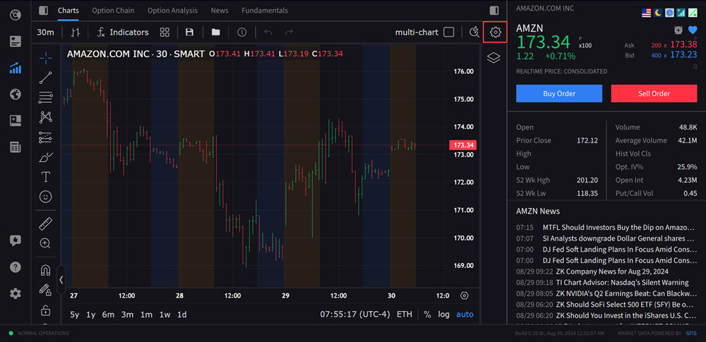
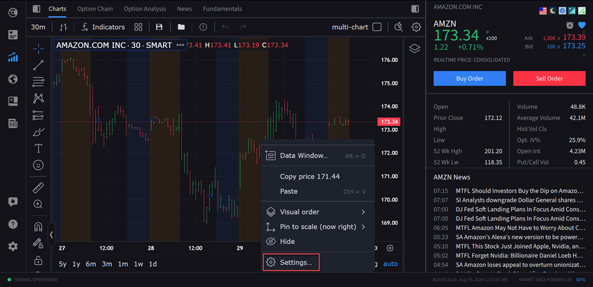
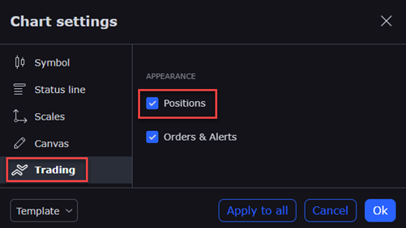
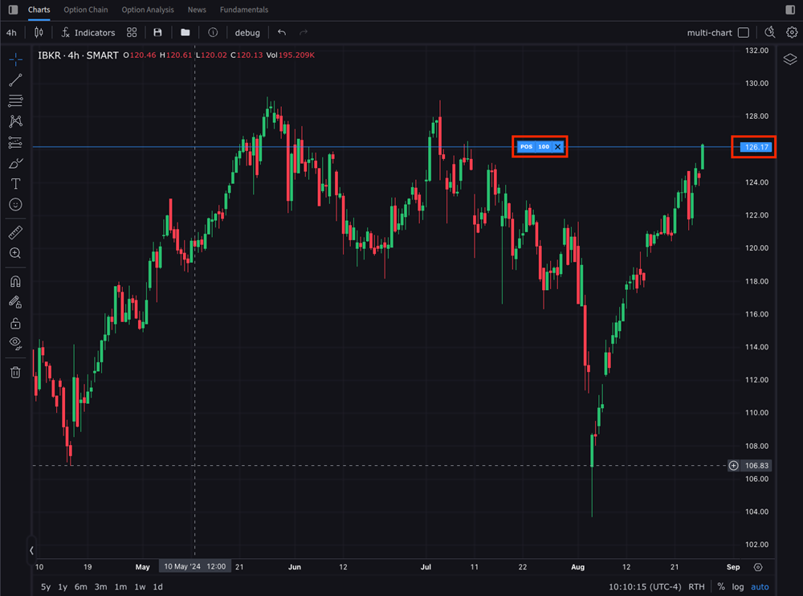

# 图上持仓与均价线（Position with Average Price）

> 原文：[ibkrguides.com/ibkrdesktop/position-with-average-price.htm](https://www.ibkrguides.com/ibkrdesktop/position-with-average-price.htm)

IBKR Desktop 图表支持把当前账户内的**未平仓合约**（Open Positions）**叠加到主图**上，并显示该持仓的**平均建仓价（Average Price）**。这一功能让交易员在图上**直接看到自己持有头寸的成本基准线**，便于**对比当前市价与成本**、**辅助止盈止损决策**、以及**直接在图上平仓**。

## 适用场景

- 在图上一眼看到**自己持仓的均价线**与当前价格的关系，**决定止盈 / 止损位**。
- 同一品种多账户 / 多策略持仓时，**集中观察成本基准**。
- 准备**减仓**时无需切到投资组合，直接在图上点 X 下平仓单。

## 关键概念

- **Average Price（平均建仓价）**：所有该品种**未平仓批次**的**加权平均成本**。当存在多批次建仓时，平均价会随加仓/减仓而**实时更新**。
- **Positions（持仓）**：账户中**未平仓**的合约（多头 / 空头）。图表上**仅显示**当前在 IBKR 账户里实际持有的品种，**不含**已平仓的历史记录。
- **X 按钮（Close Position）**：持仓标记上的关闭按钮，点击后在 Order Entry Panel 中生成**反向市价/限价单**用于平仓。

## 操作步骤：开启持仓叠加

1. 点击 IBKR Desktop 左侧 **Quote 菜单**图标打开图表区。
2. 打开 Chart Settings 窗口，方式二选一：
   - 点击右上角 **Configure 齿轮图标**（效果见下方第一张图）；
   - 或在图表上**右键**，选择 **Settings（设置）**（效果见下方第二张图）。

    

    

3. 在 **Chart Settings 窗口**左侧选择 **Trading（交易）** 选项卡。

    

4. 勾选 **Positions（持仓）** 复选框。
5. 点击 **Ok（确定）** 保存设置。
6. 返回图表，**当前账户的未平仓合约**会以**均价水平线**叠加在主图上，**右侧带持仓信息小方块**。

!!! warning "位置距离过远"
    若持仓成本与当前市价差距**过大**（如几倍价差），持仓标记可能落在**图表可视区间之外**。此时**先缩放或调整图表价格范围**（或**缩小 K 线时间区间**）让持仓价进入可视区，再操作。

## 操作步骤：图上平仓

1. **鼠标悬停**在图表上的**持仓小方块**上，方块会高亮显示。
2. 点击方块上的 **X（关闭）** 按钮。

    

3. 系统在 Order Entry Panel 中**预填**一笔**反向平仓单**（数量 = 持仓数量，方向 = 反向）。
4. 根据需要调整订单参数后**提交**即可。

## 关键要点

- **平均价实时更新**：每次加仓 / 减仓后，平均价会按剩余批次**重新加权**计算，**不是**首次建仓的固定值。
- **多账户 / 多策略**：如果同一 IBKR 账户名下的子账户或策略分别持仓，**Positions 显示的是账户总净持仓**；分账户成本需要分别查看。
- **X 按钮的订单类型**：点击 X 生成的平仓单**继承**当前 Order Entry Panel 的默认订单类型（限价 / 市价）——务必在提交前确认。
- **多空双向显示**：**多头**显示**买方成本价**，**空头**显示**卖方成本价**；空头持仓的"均价"指**建仓时的卖价**，相当于平仓的成本基准。
- **缩放协同**：建议把**持仓品种**与**对照品种**（指数、ETF）放在同一图表布局里，便于**相对强弱**对比。
- **图上平仓不是图上下单**：本功能的 X 按钮属于"**持仓**操作"（Close Position），生成的是**平仓单**；而 [图上下单](transmit-orders-chart.md) 是**主动建仓**——两者勿混淆。

## 相关章节

- [图表总览（Chart）](chart.md)
- [图上下单（Transmit Orders in Chart）](transmit-orders-chart.md)
- [扩展交易时段（Extended Trading Hours）](extended-trading-hours.md)
- [关闭指定批次（Close Specific Lots）](close-specific-lots.md)
- [下单与成交（Orders and Trades）](orders-and-trades.md)

## 原文参考

- 源站：[ibkrguides.com/ibkrdesktop/position-with-average-price.htm](https://www.ibkrguides.com/ibkrdesktop/position-with-average-price.htm)
- 源站当前返回 200 OK，本翻译对应 **Last updated on October 7, 2025** 版本。
- 截图资源（仅供 verifier 核对原文图位）：`quote-icon.png`（Quote 菜单图标）、`extended-trading.png`（Configure 齿轮）、`extended-trading1.png`（右键 Settings 菜单）、`open-positions.png`（Trading 选项卡 + Positions 复选框）、`open-positions1.png`（图上持仓小方块 + X 按钮）。
