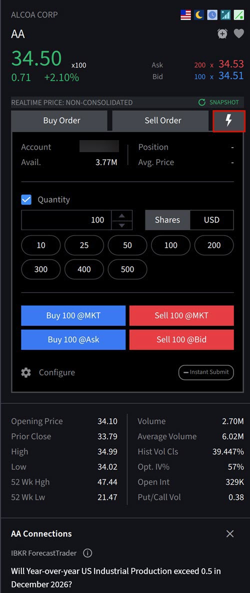
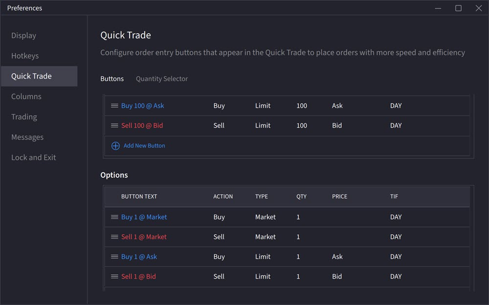

# QuickTrade（一键闪电下单）

> 原文：[ibkrguides.com/ibkrdesktop/quick-trade.htm](https://www.ibkrguides.com/ibkrdesktop/quick-trade.htm)
> 最后更新于 2025-10-14

## 概述

**QuickTrade（一键闪电下单）** 是 Rapid Order Entry 面板上的一组**预配置按钮**，**目标是用更少的点击次数完成下单**。每个按钮把"标的 + 方向 + 数量 + 价格类型"打包成一个操作，例如 `Buy 100 @MKT`（市价买入 100 股）、`Sell 100 @MKT`（市价卖出 100 股）。

这组按钮是**可配置的**——你可以根据自己最常交易的品种/数量/价位，自由增删、改名、拖拽排序。

!!! note "QuickTrade 与 Rapid Order Entry 的关系"
    QuickTrade **不是独立的下单面板**，而是内嵌在 Rapid Order Entry 右上角的一个工具集。点击闪电图标才出现，不点时面板保持普通手动下单形态。点 "Configure" 可以调整按钮的个数和顺序。

---

## 操作步骤

1. 在 **Portfolio（持仓）** 或 **Watchlist（自选股）** 中搜索或点击一个标的。
2. 屏幕右侧的 **Order Entry（下单）** 面板会自动切换到该标的。
3. 点击下单面板上的 **⚡ Lightning Bolt（闪电）图标**，展开 QuickTrade 按钮组。
4. 点击任一 QuickTrade 按钮（例如 `Buy 100 @MKT` 或 `Sell 100 @MKT`），**直接下单，无需再填参数**。
5. 如需调整按钮，点击 **Configure（配置）** 按钮进入编辑模式。
6. 在编辑模式中：
    - **新增按钮**：点击 **+ Add New Button**。
    - **调整顺序**：用按钮左侧的 **三横线（拖拽）图标** 抓取按钮拖到目标位置。

!!! note "图 3 缺失说明"
    源站 `quick-trade.htm` **仅嵌入 2 张图**（步骤 3 闪电图标、步骤 5 Configure 入口），步骤 6 的 "+ Add New Button" / 三横线拖拽界面**没有独立配图**，本章节以文字描述为主。

---

## 关键要点

- **目标场景**：高频重复下单的标的（比如日内反复加仓同一只 ETF、按相同数量做 T+0），**用 QuickTrade 把"重复填参数"压缩到一次点击**。少量、参数多变的单用普通手动下单更合适。
- **默认按钮含义**：原厂默认按钮形如 `Buy 100 @MKT`，代表"市价买入 100 股/单位"——具体单位跟随合约乘数（股票=股、期权=张、期货=手）。
- **价格类型不止 MKT**：按钮可以配置为 `LMT`（限价）、`STP`（止损）、`MKT + SL + PT`（带止损止盈的市价单），不限于市价。
- **配置是账户级别的**：同一 IB 账户在多台设备登录时，QuickTrade 配置会跟随账户，**不跟随设备**。
- **与 Advanced 面板的区别**：QuickTrade 只负责"快速成交"——是单笔市价/限价/止损单的快捷入口；要做 Iceberg、Bracket、Algo 这种结构化订单，仍需要展开 Advanced 面板。
- **风险提示**：市价按钮 (`@MKT`) **执行速度优先**，极端市况下可能以显著偏离预期的价格成交，**适合流动性好的标的**；流动性差的合约谨慎使用。

---

## 相关章节

- [快速下单（Rapid Order Entry）](rapid-order-entry.md)——QuickTrade 所在的下单面板
- [Advanced 高级订单属性](advanced.md)——需要结构化订单时切换到的面板
- [止损 / 止盈 / 括号订单](orders-and-trades.md)——QuickTrade 配置中常用的下单类型
- [IBKR Desktop 入门](ibkr-desktop.md)——面板与菜单的整体布局

---

## 原文参考

- 原文 URL：<https://www.ibkrguides.com/ibkrdesktop/quick-trade.htm>
- 最后更新：2025-10-14
- IBKR Campus 教学：<https://ibkrcampus.com/trading-course/ibkr-desktop/>
- IBKR Desktop 官网：<https://www.interactivebrokers.com/en/trading/ibkr-desktop.php>
