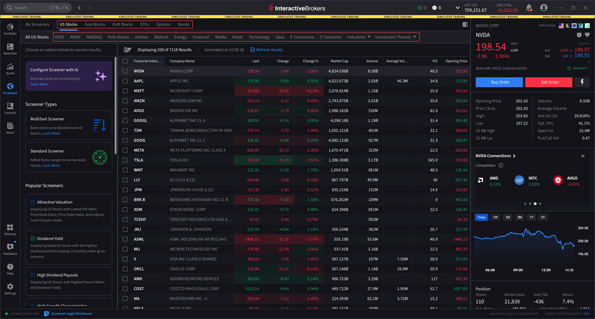
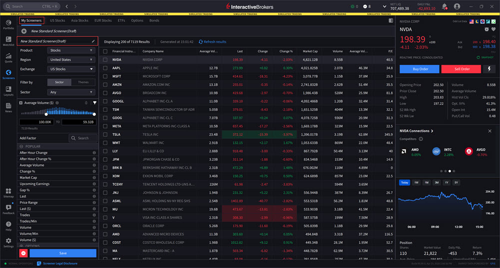

# 筛选器概览

> 原文：[ibkrguides.com/ibkrdesktop/screeners-overview.htm](https://www.ibkrguides.com/ibkrdesktop/screeners-overview.htm)
> 最后更新于 2025-10-07

## 概述

**筛选器（Screeners）** 让你按自定义条件**批量搜索产品**（股票 / ETF / 期权 / 债券），把符合财务指标、技术形态、波动率等规则的标的快速圈选出来——典型场景：找"市值 > 100 亿、PE < 15、近 5 日放量"的股票。

筛选器与 [自选列表](watchlists.md) 的核心区别：

| 工具 | 用途 | 更新方式 |
|------|------|---------|
| **Watchlist 自选列表** | 手工维护的标的清单 | 手工增减 |
| **Screener 筛选器** | 按规则**动态**筛出符合条件的标的 | 实时按规则重算 |

## 操作步骤

1. **打开筛选器面板**：在 IBKR Desktop 主界面**左侧导航栏**点击 **Screeners**  图标（漏斗形状的图标），筛选器窗口打开。

    !!! note "界面位置"
        左下角，紧邻 Portfolio / Watchlist 图标。

2. **选择产品分类**：点击窗口顶部的分类标签页，切换产品类型：

    - **US Stocks**（美股）
    - **Asia Stocks**（亚太股票，含港股/日股/韩股等）
    - **EUR Stocks**（欧洲股票）
    - **ETFs**（交易所交易基金）
    - **Options**（期权）

    每个分类下还需要选择具体的**交易所（Exchange）**（如 NASDAQ、NYSE、HKEX、TSE 等）。

    !!! note "界面位置"
        筛选器窗口顶部 → 5 个分类标签页（US Stocks / Asia Stocks / EUR Stocks / ETFs / Options）→ 交易所下拉。

        

3. **选择筛选器类型**：选好产品后，从三种筛选器类型中选一种：

    - **[MultiSort 筛选器（源站链接）](https://www.ibkrguides.com/ibkrdesktop/multi-sort-screener.htm)** — 按**多列同时排序**对比（适合需要同时看多个指标的场景）
    - **[Standard Filters 筛选器（源站链接）](https://www.ibkrguides.com/ibkrdesktop/standard-filters-screener.htm)** — 经典**单条件筛选**（适合快速按一个指标过滤）
    - **[Popular Screeners 热门筛选器（源站链接）](https://www.ibkrguides.com/ibkrdesktop/popular-screeners.htm)** — IBKR 预置的**常用模板**（如"高股息股""创新高""低 PE"等）

4. **调用已保存的筛选器**：点击窗口顶部的 **My Screeners** 标签页，可调出**之前保存的自定义筛选器**——避免每次重新配置相同条件。

    !!! note "适用场景"
        每日开盘前用同一组规则扫描同一个标的池。

        

## 关键要点

- **入口**：左侧导航栏的 **Screeners** 图标（漏斗形）。
- **5 个产品分类**：US Stocks / Asia Stocks / EUR Stocks / ETFs / Options。
- **3 种筛选器类型**：
  - **MultiSort**（多列排序）— 同时按多个指标排序查看
  - **Standard Filters**（标准筛选器）— 单条件过滤
  - **Popular Screeners**（热门筛选器）— IBKR 预置模板
- **My Screeners**：自定义筛选器的保存与回放入口。
- **交易所**：每个分类下需指定具体交易所，否则按默认筛选。
- **与 TWS 的关系**：TWS 中对应的功能是 **Advanced Market Scanner**（高级市场扫描器）；IBKR Desktop 的 Screeners **界面更精简**，底层数据源与 TWS Scanner 一致。

## 相关章节链接

- [筛选器](screeners.md)（父索引页）
- [MultiSort 筛选器（源站链接）](https://www.ibkrguides.com/ibkrdesktop/multi-sort-screener.htm)（按子页链接）
- [Standard Filters 筛选器（源站链接）](https://www.ibkrguides.com/ibkrdesktop/standard-filters-screener.htm)（按子页链接）
- [热门筛选器（源站链接）](https://www.ibkrguides.com/ibkrdesktop/popular-screeners.htm)（按子页链接）
- [自选列表](watchlists.md)（与筛选器的对比）
- [图表基础](chart.md)（筛选结果可加到图表面板）

## 其他资源

- [IBKR Campus — IBKR Desktop Market Screeners 课程](https://ibkrcampus.com/trading-lessons/ibkr-desktop-market-screeners/)
- [IBKR Desktop 官网介绍](https://www.interactivebrokers.com/en/trading/ibkr-desktop.php)

## 原文参考

- 源站 URL：https://www.ibkrguides.com/ibkrdesktop/screeners-overview.htm
- 源站最后更新日期：2025-10-07
- 截图：源站含 3 张截图（Screeners 图标 / 筛选器参数窗口 / My Screeners 标签页），均为 IBKR Desktop 官方 UI 截图；本译本已全部嵌入。
- 信息缺口：源站未说明"IBKR Desktop 筛选器借用 TWS Market Scanner"——本译本"与 TWS 的关系"小节的内容为基于 IBKR 全产品一致性的常识性补充，**未在源站原文逐字出现**。