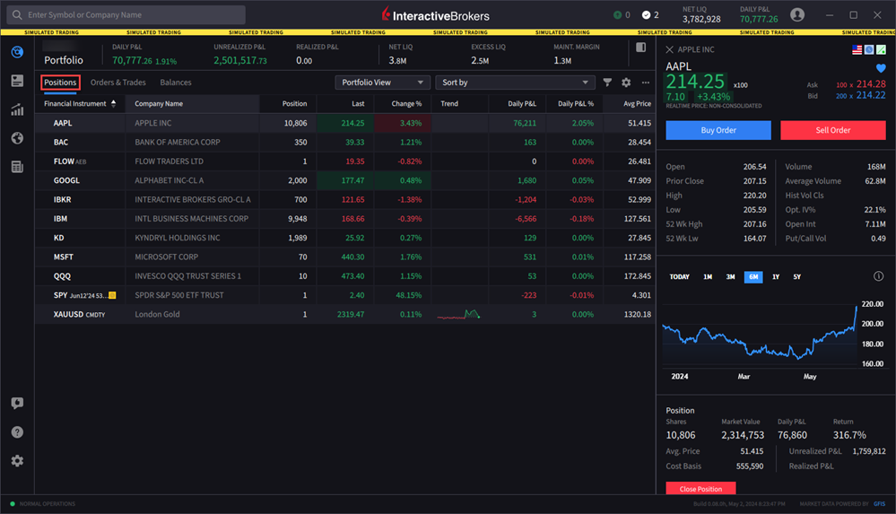
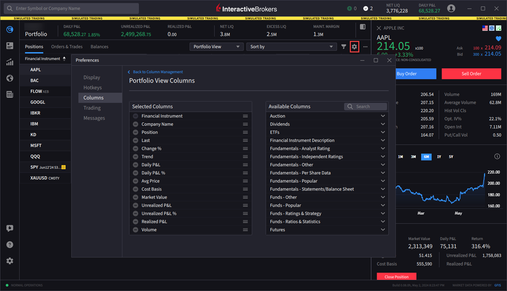
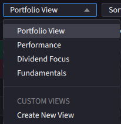
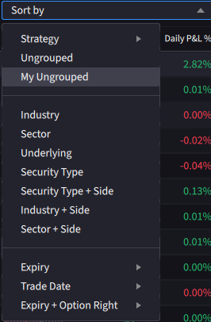

# 查看持仓（View Positions）

> 原文：[ibkrguides.com/ibkrdesktop/view-positions.htm](https://www.ibkrguides.com/ibkrdesktop/view-positions.htm)
> 最后更新于 2025-10-07

## 概述

持仓（Positions）页面是 IBKR Desktop 中查看账户当前所有未平仓头寸的入口。你可以通过 **Portfolio**（投资组合）菜单打开它——按以下步骤操作即可。

!!! info "对照 TWS"
    TWS 中等价的视图是 **Monitor Panel → Portfolio 标签页**，以及 **Account Window** 中的 "Portfolio" 区。IBKR Desktop 把持仓集中到 **Portfolio → Positions** 单个标签页，**不再需要多窗口对照**。

!!! note "界面位置"
    主窗口 **左上角 Portfolio 图标** → 默认进入 **Positions** 标签页 → 显示当前账户所有未平仓头寸的列表（每行一条持仓）。

---

## 操作步骤

1. 点击主界面**左上角**的 **Portfolio** 菜单图标（一个小折线图样图标）。

    !!! note "界面位置"
        Portfolio 图标固定在 IBKR Desktop 主窗口的左上角，任何页面都可以点击进入。

        

2. 点击 **Positions** 标签页。

    !!! note "界面位置"
        Portfolio 面板打开后默认显示 Positions 标签页（持仓是最高频查看的视图）；如果当前不在 Positions，点击顶部标签切换。

        

3. 点击**右上角**的 **Configure（齿轮图标）**，编辑要在列表里显示的列。

    !!! note "界面位置"
        Positions 列表右上角的齿轮状图标，点击后弹出列管理对话框——勾选你要显示的字段（如 Symbol、Quantity、Cost Basis、Market Value、Unrealized P&L 等），不勾选的就隐藏。

        

4. 使用 **View（下拉菜单）**选择不同的列分组视图——可以是预设视图，也可以是你自己保存的**自定义视图**。

    !!! note "界面位置"
        Positions 面板顶部有一个 "View" 下拉框。常见预设包括：All（全部字段）、Compact（精简）、Custom（自定义）。

        

5. 使用 **Sort by（排序）**菜单按不同字段排序持仓（默认按 Symbol 字母序）。

    !!! note "界面位置"
        View 下拉框旁边的 "Sort by" 下拉框。常见排序字段：Symbol（代码）、Market Value（市值）、Unrealized P&L（未实现盈亏）、% Change（涨跌幅）等。

        

6. 点击 **Filter（漏斗图标）**，按代码（symbol）和/或资产类型（asset type）过滤持仓列表。

    !!! note "界面位置"
        Sort by 旁边的漏斗形 Filter 图标 。过滤是叠加生效的——多个条件之间是 AND 关系。

7. 使用 **More（更多菜单）**  设置 **Show Zero Positions（显示零持仓）** 和/或 **Show Cash Rows（显示现金行）**。

    !!! note "界面位置"
        列表右上角的 "More" 菜单（通常是三点或齿轮旁的下拉箭头）。开启后，已平仓但当日有过交易的代码行、以及账户的现金余额行都会出现在列表中——便于核对当日已清仓头寸的真实盈亏。

---

## 关键要点

- Positions 标签页的**数据是实时刷新**的——持仓数量、市价、未实现盈亏随行情变化自动更新。
- 右键一条持仓可以**直接平仓**、**修改止损**、**查看合约详情**、**跳转到图表**等——具体右键菜单随市场状态而变。
- **Configure（齿轮）** 和 **Filter（漏斗）** 是 IBKR Desktop 中所有列表视图通用的两个图标——熟悉它们能极大提高效率。
- 默认持仓**不含现金**——要同时查看账户现金余额，请切到 **Balances** 标签页或打开 **Show Cash Rows**。

!!! tip "对照 TWS"
    TWS Mosaic 的 Portfolio 标签页功能类似，但 IBKR Desktop 的 **View 下拉**比 TWS 更直观——自定义视图可以一键保存并命名，适合多策略交易者切换"按标的 / 按策略 / 按盈亏"的视图。

---

## 相关章节

- [查看余额（Balances）](view-balances.md)
- [订单与成交（Orders & Trades）](orders-and-trades.md)
- [快速下单（Rapid Order Entry）](rapid-order-entry.md)
- [关闭指定批次（Close Specific Lots）](close-specific-lots.md)
- [退出策略（Exit Strategy）](exit-strategy.md)
- [自定义投资组合指标](customize-portfolio-metrics.md)
- 外部：[IBKR Campus - IBKR Desktop Interface](https://ibkrcampus.com/trading-course/ibkr-desktop/)
- 外部：[IBKR Desktop 产品页](https://www.interactivebrokers.com/en/trading/ibkr-desktop.php)

---

## 原文参考

- 原文 URL：<https://www.ibkrguides.com/ibkrdesktop/view-positions.htm>
- 最后更新：2025-10-07
- 引用图片：
    - `resources/images/portfolioicon.png`（Portfolio 菜单图标）
    - `resources/images/portfolio-positions.png`（Positions 标签页总览）
    - `resources/images/portfolio-positions1.png`（Configure 齿轮图标位置）
    - `resources/images/portfolioview.png`（View 下拉菜单）
    - `resources/images/sortby.png`（Sort by 下拉菜单）
    - `resources/images/filter-icon.png`（Filter 漏斗图标）
    - `resources/images/more-menu-icon.png`（More 菜单图标）
